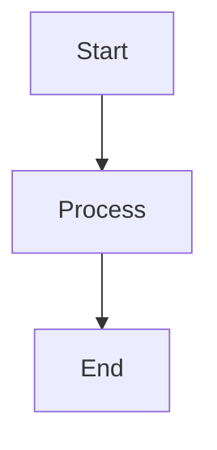

# Solution Architecture Design Documentation

This repository contains the Solution Architecture Design documentation built with [Docusaurus](https://docusaurus.io/), a modern static site generator.

## 📚 For Content Editors

All documentation content is stored in **markdown files** located in the `docs/` folder. You can edit these files directly to update the documentation.

### How to Edit Content

1. **Navigate to the `docs/` folder** in this repository
2. **Find the markdown file** you want to edit (e.g., `docs/prerequisites.md`)
3. **Edit the file** using any text editor or directly in GitLab's web editor
4. **Commit your changes** with a descriptive commit message
5. **Push to the main branch** - the site will automatically rebuild and deploy (takes ~2-3 minutes)

### File Organization

```
docs/
├── index.md                                    # 1. Introduction
├── prerequisites.md                            # 1.1. Prerequisites
├── requirements-overview/                      # 1.2. Requirements Overview
│   ├── index.md
│   ├── functional-requirements.md
│   └── non-functional-requirements.md
├── stakeholders.md                             # 1.3. Stakeholders
├── constraints/                                # 2. Constraints
│   ├── index.md
│   ├── technical-organizational-constraints.md
│   └── conventions/
│       ├── index.md
│       └── enterprise-standards.md
├── architecture-overview/                      # 3. Architecture Overview
│   ├── index.md
│   ├── business-context.md
│   └── logical-solution-overview.md
├── detailed-architecture/                      # 4. Detailed Architecture
│   ├── index.md
│   ├── technical-context.md
│   ├── interface-inventory/
│   │   ├── index.md
│   │   ├── interface-1.md
│   │   └── interface-2.md
│   ├── presentation-layer.md
│   └── business-layer.md
├── multi-processing-center/                    # 5. Multi-Processing Center
│   ├── index.md
│   └── architectural-concerns-testing.md
├── architectural-decisions.md                  # 6. Architectural Decisions
├── architectural-risks-issues/                 # 7. Risks and Issues
│   ├── index.md
│   ├── architectural-risks.md
│   └── architectural-issues.md
└── glossary.md                                 # 8. Glossary
```

### Markdown Basics

**Headers:**
```markdown
# Heading 1
## Heading 2
### Heading 3
```

**Bold and Italic:**
```markdown
**bold text**
*italic text*
```

**Lists:**
```markdown
- Bullet point 1
- Bullet point 2

1. Numbered item 1
2. Numbered item 2
```

**Links:**
```markdown
[Link text](https://example.com)
[Link to another page](./other-page.md)
```

**Images:**
```markdown

```

**Tables:**
```markdown
| Column 1 | Column 2 |
|----------|----------|
| Data 1   | Data 2   |
| Data 3   | Data 4   |
```

**Code Blocks:**
````markdown
```typescript
function example() {
  return "Hello";
}
```
````

**Admonitions (Notes, Tips, Warnings):**
```markdown
:::note
This is a note
:::

:::tip
This is a tip
:::

:::warning
This is a warning
:::

:::danger
This is a danger alert
:::
```

### Adding Images

1. Place your image in the `static/img/` folder
2. Reference it in markdown: ``

### Creating Diagrams

This site supports [Mermaid](https://mermaid.js.org/) diagrams. Example:

````markdown

````

### Important: What NOT to Edit

**DO NOT edit these files unless you're a developer:**
- `docusaurus.config.ts` - Site configuration
- `sidebars.ts` - Navigation structure
- `package.json` - Dependencies
- `.gitlab-ci.yml` - Deployment configuration
- Files in `src/` directory - React components

## 🚀 For Developers

### Prerequisites

- Node.js 18 or higher
- npm or yarn

### Local Development

1. **Install dependencies:**
   ```bash
   npm install
   ```

2. **Start development server:**
   ```bash
   npm start
   ```

   This opens a browser at `http://localhost:3000` with live reload.

3. **Build for production:**
   ```bash
   npm run build
   ```

   This generates static files in the `build/` directory.

4. **Serve production build locally:**
   ```bash
   npm run serve
   ```

### Project Structure

```
project-root/
├── docs/                   # Documentation markdown files (edit these!)
├── src/                    # React components and pages
│   ├── components/         # Custom React components
│   ├── css/               # Custom CSS
│   └── pages/             # Custom pages
├── static/                # Static assets (images, files)
│   └── img/              # Images
├── docusaurus.config.ts   # Docusaurus configuration
├── sidebars.ts            # Sidebar navigation structure
├── package.json           # Dependencies and scripts
├── .gitlab-ci.yml         # GitLab CI/CD pipeline
└── README.md              # This file
```

### Configuration

#### Update GitLab Pages URL

Edit `docusaurus.config.ts`:

```typescript
url: 'https://your-username.gitlab.io',
baseUrl: '/your-repository-name/',
organizationName: 'your-username',
projectName: 'your-repository-name',
```

#### Modify Navigation

Edit `sidebars.ts` to change the sidebar structure.

#### Customize Theme

Edit `src/css/custom.css` to customize colors, fonts, and other styles.

### Deployment

#### GitLab Pages (Automatic)

The site automatically deploys to GitLab Pages when you push to the `main` branch.

**GitLab Pages URL:**
`https://your-username.gitlab.io/your-repository-name/`

#### Manual Deployment

If you need to deploy manually:

```bash
npm run build
# Deploy the build/ directory to your hosting provider
```

### Available Scripts

| Command | Description |
|---------|-------------|
| `npm start` | Start local development server |
| `npm run build` | Build for production |
| `npm run serve` | Serve production build locally |
| `npm run clear` | Clear Docusaurus cache |
| `npm run typecheck` | Run TypeScript type checking |

### Troubleshooting

**Build fails with "broken links":**
- Check that all internal links point to existing files
- Fix the links or set `onBrokenLinks: 'warn'` in `docusaurus.config.ts`

**Diagrams not rendering:**
- Ensure `@docusaurus/theme-mermaid` is installed
- Check that mermaid is enabled in `docusaurus.config.ts`

**Changes not showing up:**
- Clear cache: `npm run clear`
- Restart dev server: stop and run `npm start` again

**GitLab Pages not updating:**
- Check GitLab CI/CD pipeline status in GitLab
- Ensure the pipeline completed successfully
- Check that the `main` branch has your latest changes

### Support

- **Docusaurus Documentation:** https://docusaurus.io/docs
- **Markdown Guide:** https://www.markdownguide.org/
- **Mermaid Diagrams:** https://mermaid.js.org/

## 📝 License

Copyright © ${new Date().getFullYear()} Solution Architecture Documentation

---

**Built with ❤️ using Docusaurus**
