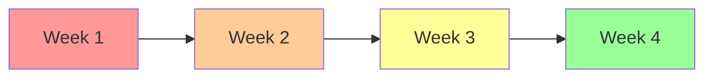

# Architectural Risks

This section details specific architectural risks that could impact the solution's success, along with their mitigation strategies.

## Critical Risks

### R-001: Third-Party Service Dependency

**Category:** External

**Description:**
The system depends on [external service/API] for critical functionality. If this service experiences downtime or degraded performance, it directly impacts our system's ability to serve users.

**Probability:** Medium

**Impact:** High

**Risk Level:** HIGH

**Mitigation Strategy:**
1. **Circuit Breaker:** Implement circuit breaker pattern to fail fast
2. **Fallback:** Provide degraded functionality using cached data
3. **SLA Monitoring:** Monitor external service SLA compliance
4. **Alternative Provider:** Identify and document alternative providers
5. **Local Cache:** Cache responses for [X] minutes

**Contingency Plan:**
- If service is down > 30 minutes, switch to alternative provider
- Use cached data for read operations
- Queue write operations for retry when service recovers

**Owner:** Integration Team Lead

**Status:** Mitigating

**Last Updated:** 2024-02-01

---

### R-002: Database Scalability Limits

**Category:** Technical

**Description:**
As data volume and user base grow, the current database architecture may reach scalability limits, potentially causing performance degradation or outages.

**Probability:** Medium

**Impact:** High

**Risk Level:** HIGH

**Indicators:**
- Database CPU > 80% sustained
- Query response time degrading
- Connection pool exhaustion
- Storage capacity > 70%

**Mitigation Strategy:**
1. **Read Replicas:** Implement read replicas to distribute read load
2. **Caching:** Aggressive caching of frequently accessed data
3. **Query Optimization:** Regular query performance reviews
4. **Archival:** Archive old data to separate storage
5. **Sharding Plan:** Prepare sharding strategy if needed

**Long-term Solution:**
- Evaluate distributed database solutions (CockroachDB, Vitess)
- Design data model for sharding
- Implement application-level sharding

**Owner:** Database Team / Architect

**Status:** Monitoring

**Target Resolution:** Q3 2024

---

## High Risks

### R-003: Security Vulnerability in Dependencies

**Category:** Technical

**Description:**
Third-party libraries and dependencies may contain security vulnerabilities that could be exploited, compromising system security.

**Probability:** High (industry trend)

**Impact:** High

**Risk Level:** HIGH

**Mitigation Strategy:**
1. **Automated Scanning:** Run dependency vulnerability scans in CI/CD
2. **Regular Updates:** Monthly dependency update schedule
3. **Security Monitoring:** Subscribe to security advisories
4. **Penetration Testing:** Quarterly security audits
5. **Rapid Response:** Process for emergency security patches

**Preventive Measures:**
- Use only well-maintained, popular libraries
- Minimize number of dependencies
- Pin dependency versions
- Review security implications before adding dependencies

**Owner:** Security Team / Tech Lead

**Status:** Mitigating

---

### R-004: Insufficient Load Testing

**Category:** Technical

**Description:**
The system may not perform adequately under expected production load due to insufficient performance testing.

**Probability:** Medium

**Impact:** High

**Risk Level:** HIGH

**Mitigation Strategy:**
1. **Load Testing:** Comprehensive load testing at 2x expected load
2. **Stress Testing:** Test breaking points
3. **Endurance Testing:** 24-hour sustained load tests
4. **Production Monitoring:** Real-time performance monitoring
5. **Auto-scaling:** Configure auto-scaling with tested thresholds

**Testing Plan:**
- Baseline: 1000 concurrent users
- Peak Load: 2000 concurrent users
- Stress Test: 5000 concurrent users
- Duration: 24-hour sustained test

**Owner:** QA Team / Performance Engineer

**Status:** In Progress

**Target Completion:** 2024-02-28

---

### R-005: Inadequate Disaster Recovery

**Category:** Technical / Operational

**Description:**
Current disaster recovery procedures may not be sufficient to meet RTO/RPO requirements, potentially leading to extended downtime or data loss.

**Probability:** Low (but high impact if occurs)

**Impact:** Critical

**Risk Level:** HIGH

**Mitigation Strategy:**
1. **DR Plan:** Document comprehensive disaster recovery plan
2. **Automated Backups:** Daily automated backups with verification
3. **DR Testing:** Quarterly DR drill exercises
4. **Geo-Redundancy:** Deploy in multiple geographic regions
5. **Runbooks:** Detailed runbooks for recovery procedures

**Recovery Targets:**
- RTO: 4 hours
- RPO: 1 hour

**Owner:** DevOps Team / Architect

**Status:** In Progress

**Target Completion:** 2024-03-15

---

## Medium Risks

### R-006: Team Knowledge Concentration

**Category:** Organizational

**Description:**
Critical system knowledge concentrated in few team members. Loss of key personnel could significantly impact development and operations.

**Probability:** Medium

**Impact:** Medium

**Risk Level:** MEDIUM

**Mitigation Strategy:**
1. **Documentation:** Comprehensive system documentation
2. **Knowledge Sharing:** Regular knowledge-sharing sessions
3. **Pair Programming:** Rotate pairs to spread knowledge
4. **Cross-Training:** Train team members across components
5. **Succession Planning:** Identify and train backup resources

**Action Items:**
- Document critical system components
- Create architecture training program
- Rotate team members across components
- Record walkthrough videos

**Owner:** Engineering Manager

**Status:** In Progress

---

### R-007: Technology Obsolescence

**Category:** Technical

**Description:**
Selected technologies may become outdated or unsupported, requiring costly migration in the future.

**Probability:** Low (5-10 year horizon)

**Impact:** Medium

**Risk Level:** MEDIUM

**Mitigation Strategy:**
1. **Technology Radar:** Monitor technology trends
2. **Community Health:** Assess community activity and support
3. **Abstraction Layers:** Use abstraction to minimize vendor lock-in
4. **Upgrade Path:** Maintain current with framework updates
5. **Migration Plan:** Document migration strategy if needed

**Monitoring:**
- Framework release cadence
- Community activity (GitHub stars, commits, issues)
- Vendor support commitments
- Industry adoption trends

**Owner:** Architect / Tech Lead

**Status:** Monitoring

---

### R-008: Integration Complexity

**Category:** Technical

**Description:**
Multiple integrations with diverse external systems create complexity and potential failure points.

**Probability:** Medium

**Impact:** Medium

**Risk Level:** MEDIUM

**Mitigation Strategy:**
1. **Integration Layer:** Centralized integration layer
2. **Standard Patterns:** Use standard integration patterns
3. **Error Handling:** Robust error handling and retry logic
4. **Circuit Breakers:** Protect against cascading failures
5. **Monitoring:** Comprehensive integration monitoring

**Best Practices:**
- Document each integration thoroughly
- Implement health checks for each integration
- Use adapter pattern for flexibility
- Test failure scenarios

**Owner:** Integration Team Lead

**Status:** Mitigating

---

## Low Risks

### R-009: Documentation Drift

**Category:** Organizational

**Description:**
System documentation becomes outdated as system evolves, making maintenance difficult.

**Probability:** High

**Impact:** Low

**Risk Level:** LOW

**Mitigation Strategy:**
1. **Documentation in Code:** Use inline documentation
2. **Review Process:** Include documentation review in PR process
3. **Automated Generation:** Auto-generate API docs from code
4. **Regular Audits:** Quarterly documentation review
5. **Documentation Tests:** Test code examples in documentation

**Owner:** Tech Lead / Documentation Lead

**Status:** Monitoring

---

### R-010: Development Environment Inconsistency

**Category:** Technical

**Description:**
Differences between development and production environments may lead to deployment issues.

**Probability:** Medium

**Impact:** Low

**Risk Level:** LOW

**Mitigation Strategy:**
1. **Containerization:** Use Docker for consistent environments
2. **Infrastructure as Code:** Version control all infrastructure
3. **Environment Parity:** Keep environments as similar as possible
4. **Automated Setup:** Scripts for environment setup
5. **Regular Sync:** Periodically sync development with production

**Owner:** DevOps Team

**Status:** Mitigating

---

## Risk Trends

**Trend:** Risk posture improving over time with active mitigation.

## Risk Review Schedule

| Risk ID | Next Review Date | Review Frequency | Reviewer |
|---------|-----------------|------------------|----------|
| R-001 | 2024-02-15 | Weekly | Integration Lead |
| R-002 | 2024-02-10 | Bi-weekly | Architect |
| R-003 | 2024-02-05 | Weekly | Security Team |
| R-004 | 2024-02-12 | Weekly | QA Lead |
| R-005 | 2024-02-08 | Weekly | DevOps Lead |

---

:::warning High Risk Items
Risks R-001 through R-005 are high priority and should be reviewed in every architecture meeting.
:::

:::tip Risk Mitigation
Each risk should have a named owner and specific mitigation actions with deadlines. Update this document as risks evolve.
:::
