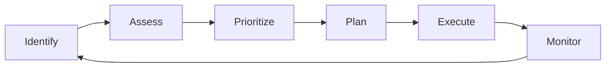
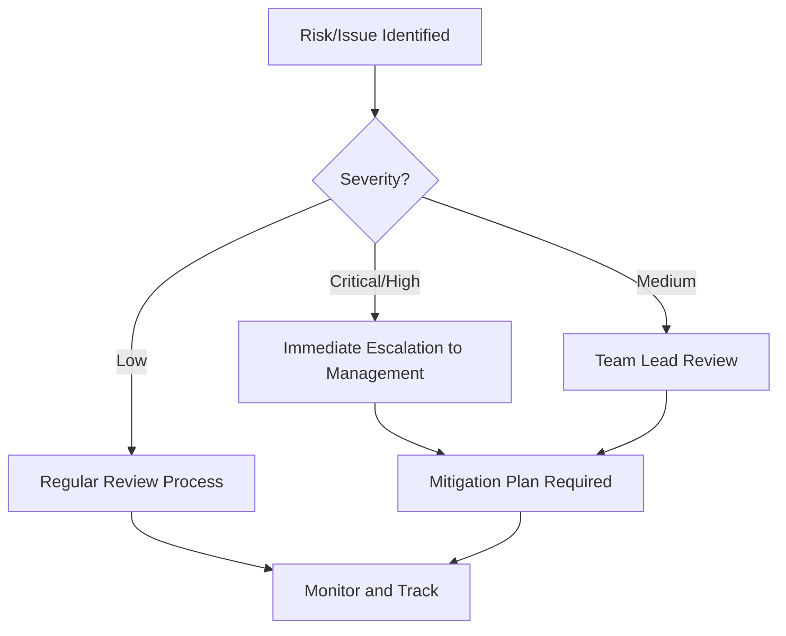

# Architectural Risks and Issues

This section identifies, documents, and tracks architectural risks and issues that may impact the solution. Understanding and managing these concerns is critical for project success.

## Overview

### Risks vs Issues

**Risks:**
- Potential problems that may occur in the future
- Have probability and impact
- Require mitigation strategies
- Proactive management

**Issues:**
- Problems that currently exist
- Require immediate attention and resolution
- Impact project now
- Reactive management

## Risk and Issue Management Process

### Risk Assessment Matrix

| Probability / Impact | Low | Medium | High |
|---------------------|-----|--------|------|
| **High** | Medium | High | Critical |
| **Medium** | Low | Medium | High |
| **Low** | Low | Low | Medium |

**Risk Levels:**
- **Critical:** Immediate attention required, executive involvement
- **High:** Urgent mitigation needed, escalate to management
- **Medium:** Monitor closely, implement mitigation
- **Low:** Monitor, may not require immediate action

## Risk Categories

### Technical Risks

Risks related to technology choices, implementation, and technical constraints.

[See Architectural Risks →](./architectural-risks.md)

### Organizational Risks

Risks related to resources, processes, and organizational factors.

[See Architectural Risks →](./architectural-risks.md)

### External Risks

Risks from external dependencies, vendors, and market factors.

[See Architectural Risks →](./architectural-risks.md)

## Issue Categories

### Current Technical Issues

Technical problems currently affecting or blocking development.

[See Architectural Issues →](./architectural-issues.md)

### Design Issues

Problems with the current design that need resolution.

[See Architectural Issues →](./architectural-issues.md)

### Integration Issues

Problems with system integration or external dependencies.

[See Architectural Issues →](./architectural-issues.md)

## Risk Register

| ID | Risk | Category | Probability | Impact | Level | Owner | Status |
|----|------|----------|------------|--------|-------|-------|--------|
| R-001 | [Risk description] | Technical | High | High | Critical | [Name] | Open |
| R-002 | [Risk description] | External | Medium | High | High | [Name] | Mitigating |
| R-003 | [Risk description] | Organizational | Low | Medium | Low | [Name] | Monitoring |

## Issue Log

| ID | Issue | Category | Severity | Assigned To | Status | Target Date |
|----|-------|----------|----------|-------------|--------|-------------|
| I-001 | [Issue description] | Technical | High | [Name] | Open | 2024-02-15 |
| I-002 | [Issue description] | Design | Medium | [Name] | In Progress | 2024-02-20 |
| I-003 | [Issue description] | Integration | Low | [Name] | Resolved | - |

## Monitoring and Review

### Review Frequency

- **Critical Risks/Issues:** Daily review
- **High Risks/Issues:** Weekly review
- **Medium Risks/Issues:** Bi-weekly review
- **Low Risks:** Monthly review

### Escalation Path

## Reporting

### Weekly Risk Report

**Executive Summary:**
- New risks identified
- Risk level changes
- Mitigation progress
- Issues resolved
- Critical items requiring attention

**Metrics:**
- Total open risks by level
- Risks trending (increasing/decreasing)
- Average time to resolve issues
- Mitigation effectiveness

---

:::warning Active Monitoring
Risks and issues should be actively monitored and reviewed. Failure to manage architectural risks can lead to project delays, cost overruns, or system failures.
:::

:::tip Risk Mitigation
For each identified risk, develop a specific mitigation plan with clear actions, owners, and timelines.
:::
