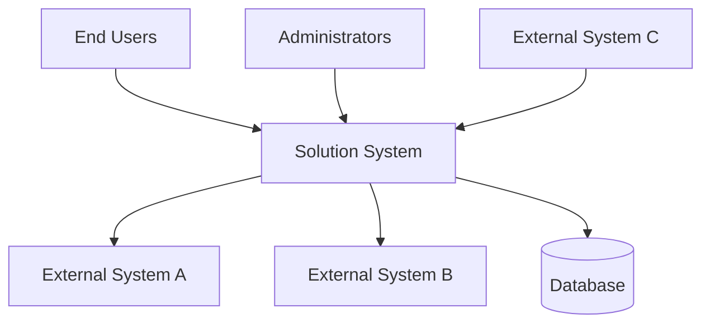

# Business Context

This section establishes the business context for the solution, describing how it fits within the organization, which business processes it supports, and how it interacts with users and external systems.

## Business Overview

### Business Problem

**Problem Statement:**
[Describe the business problem or opportunity this solution addresses]

**Current Situation:**
[Describe the current state and its limitations]

**Desired Outcome:**
[Describe the desired future state and expected benefits]

### Business Objectives

The solution aims to achieve the following business objectives:

1. **[Objective 1]**
   - **Metric:** [How success will be measured]
   - **Target:** [Specific target value]
   - **Timeline:** [When it should be achieved]

2. **[Objective 2]**
   - **Metric:** [How success will be measured]
   - **Target:** [Specific target value]
   - **Timeline:** [When it should be achieved]

3. **[Objective 3]**
   - **Metric:** [How success will be measured]
   - **Target:** [Specific target value]
   - **Timeline:** [When it should be achieved]

## Business Context Diagram

*The diagram above shows the system in its business context, identifying key users and external systems.*

## Actors and Stakeholders

### Primary Actors

| Actor | Description | Goals | Frequency of Use |
|-------|-------------|-------|------------------|
| **End User** | [Description] | [Primary goals when using the system] | Daily |
| **Administrator** | [Description] | [Primary goals when using the system] | As needed |
| **Manager** | [Description] | [Primary goals when using the system] | Weekly |

### Supporting Actors

| Actor | Description | Interaction |
|-------|-------------|-------------|
| **System Administrator** | [Description] | [How they interact with the system] |
| **Support Team** | [Description] | [How they interact with the system] |

## Business Processes

### Process 1: [Process Name]

**Description:** [Brief description of the business process]

**Current Process:**
1. [Current step 1]
2. [Current step 2]
3. [Current step 3]

**Improved Process with New Solution:**
1. [Improved step 1]
2. [Improved step 2]
3. [Improved step 3]

**Benefits:**
- [Benefit 1]
- [Benefit 2]
- [Benefit 3]

### Process 2: [Process Name]

**Description:** [Brief description of the business process]

**Current Process:**
1. [Current step 1]
2. [Current step 2]

**Improved Process with New Solution:**
1. [Improved step 1]
2. [Improved step 2]

**Benefits:**
- [Benefit 1]
- [Benefit 2]

## Business Capabilities

The solution supports the following business capabilities:

| Capability | Description | Maturity Level | Priority |
|-----------|-------------|----------------|----------|
| **[Capability 1]** | [Description] | [Current → Target] | High |
| **[Capability 2]** | [Description] | [Current → Target] | High |
| **[Capability 3]** | [Description] | [Current → Target] | Medium |
| **[Capability 4]** | [Description] | [Current → Target] | Medium |

**Maturity Levels:**
- Level 1: Initial/Ad-hoc
- Level 2: Repeatable
- Level 3: Defined
- Level 4: Managed
- Level 5: Optimized

## External Systems and Interfaces

### Upstream Systems (Provide Data/Services to This Solution)

| System | Owner | Purpose | Interface Type | Criticality |
|--------|-------|---------|---------------|-------------|
| **[System A]** | [Department] | [Purpose] | REST API | High |
| **[System B]** | [Department] | [Purpose] | File Transfer | Medium |
| **[System C]** | [Vendor] | [Purpose] | Web Services | High |

### Downstream Systems (Consume Data/Services from This Solution)

| System | Owner | Purpose | Interface Type | Criticality |
|--------|-------|---------|---------------|-------------|
| **[System X]** | [Department] | [Purpose] | REST API | High |
| **[System Y]** | [Department] | [Purpose] | Events | Medium |

### Peer Systems (Bidirectional Integration)

| System | Owner | Purpose | Interface Type | Criticality |
|--------|-------|---------|---------------|-------------|
| **[System M]** | [Department] | [Purpose] | REST API | High |

## Business Rules

Key business rules that govern system behavior:

### Rule 1: [Rule Name]

- **Description:** [Detailed description of the business rule]
- **Rationale:** [Why this rule exists]
- **Impact:** [How it affects the system]
- **Source:** [Business policy, regulation, etc.]

### Rule 2: [Rule Name]

- **Description:** [Detailed description of the business rule]
- **Rationale:** [Why this rule exists]
- **Impact:** [How it affects the system]
- **Source:** [Business policy, regulation, etc.]

## Business Value

### Quantifiable Benefits

| Benefit | Current State | Target State | Timeframe | Value |
|---------|--------------|--------------|-----------|-------|
| **Cost Reduction** | [Current cost] | [Target cost] | [Timeframe] | [Savings] |
| **Time Savings** | [Current time] | [Target time] | [Timeframe] | [Hours saved] |
| **Revenue Impact** | [Current revenue] | [Target revenue] | [Timeframe] | [Increase] |
| **Efficiency Gain** | [Current metric] | [Target metric] | [Timeframe] | [Improvement] |

### Qualitative Benefits

- **Improved User Satisfaction:** [Description of improvement]
- **Better Decision Making:** [Description of improvement]
- **Enhanced Compliance:** [Description of improvement]
- **Competitive Advantage:** [Description of improvement]
- **Risk Reduction:** [Description of improvement]

### Return on Investment (ROI)

- **Total Investment:** [Amount]
- **Expected Annual Benefits:** [Amount]
- **Payback Period:** [Timeframe]
- **3-Year ROI:** [Percentage]

## Business Risks

| Risk | Impact | Probability | Mitigation Strategy |
|------|--------|-------------|---------------------|
| **[Risk 1]** | High | Medium | [Mitigation approach] |
| **[Risk 2]** | Medium | Low | [Mitigation approach] |
| **[Risk 3]** | High | Low | [Mitigation approach] |

## Business Assumptions

1. **[Assumption 1]**
   - **Description:** [What is assumed]
   - **Impact if False:** [What happens if assumption proves wrong]
   - **Validation:** [How to validate this assumption]

2. **[Assumption 2]**
   - **Description:** [What is assumed]
   - **Impact if False:** [What happens if assumption proves wrong]
   - **Validation:** [How to validate this assumption]

## Success Metrics

### Key Performance Indicators (KPIs)

| KPI | Current Baseline | Target | Measurement Method | Review Frequency |
|-----|-----------------|--------|-------------------|------------------|
| **[KPI 1]** | [Baseline] | [Target] | [How measured] | Monthly |
| **[KPI 2]** | [Baseline] | [Target] | [How measured] | Quarterly |
| **[KPI 3]** | [Baseline] | [Target] | [How measured] | Monthly |

### User Adoption Metrics

- **User Registration Rate:** [Target]
- **Active Users:** [Target]
- **User Satisfaction Score:** [Target]
- **Training Completion Rate:** [Target]

---

:::tip Business Context Evolution
The business context may evolve as market conditions, business priorities, or organizational structure changes. Review and update this section regularly.
:::
