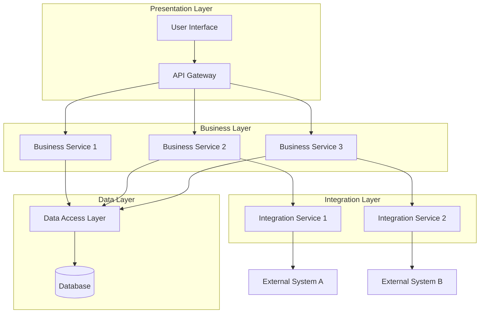
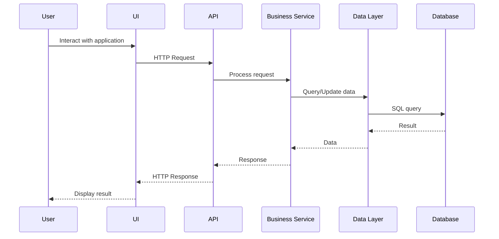
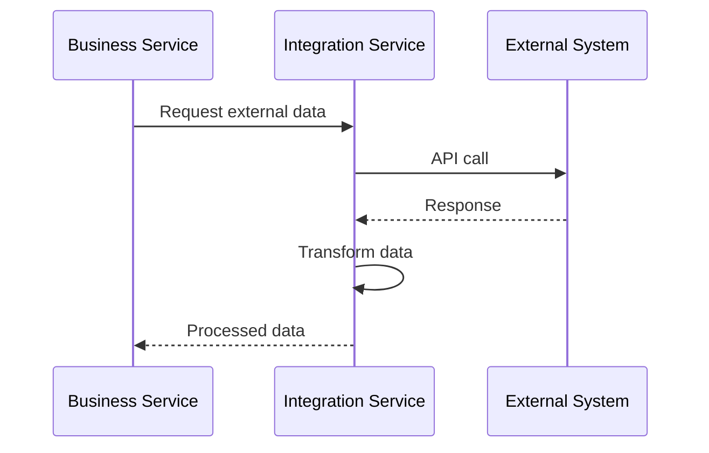
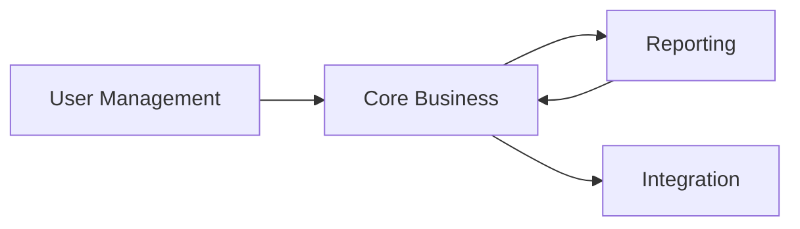
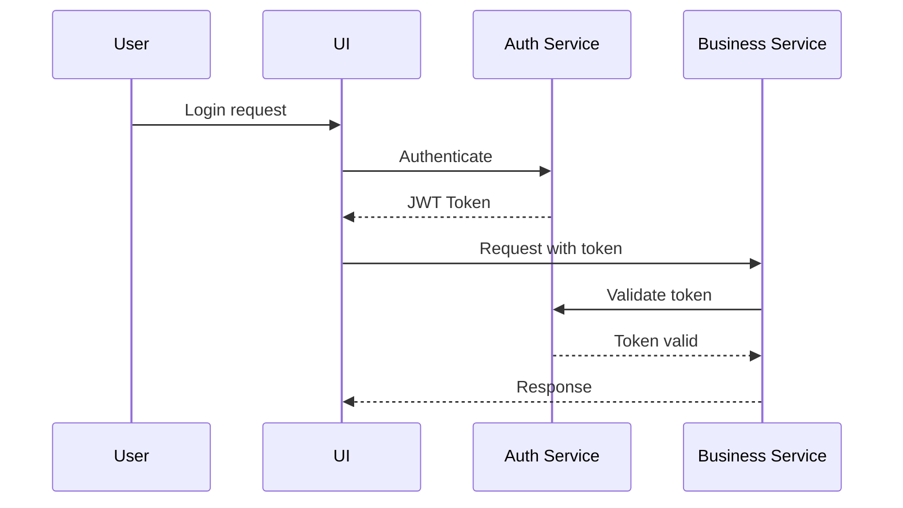

# Logical Solution Overview

This section provides a logical view of the solution architecture, describing the major components, their responsibilities, and how they interact, without going into implementation-specific details.

## Logical Architecture Diagram



## Architecture Layers

### Presentation Layer

The presentation layer is responsible for user interaction and displaying information.

**Components:**
- **User Interface:** Web-based interface for end users
- **API Gateway:** Entry point for all API requests

**Responsibilities:**
- Render user interfaces
- Handle user input and validation
- Route API requests to appropriate services
- Implement authentication and authorization
- Handle session management

**Technology Approach:**
- [Frontend framework]
- [API gateway technology]

### Business Layer

The business layer contains the core business logic and orchestrates business processes.

**Components:**
- **Business Service 1:** [Description and responsibility]
- **Business Service 2:** [Description and responsibility]
- **Business Service 3:** [Description and responsibility]

**Responsibilities:**
- Implement business logic and rules
- Orchestrate complex business processes
- Coordinate between different services
- Apply business validations
- Handle business events and workflows

**Design Patterns:**
- Service-oriented architecture
- Domain-driven design
- [Other patterns]

### Data Layer

The data layer manages data persistence and retrieval.

**Components:**
- **Data Access Layer:** Abstraction over data storage
- **Database:** Primary data store

**Responsibilities:**
- Data persistence and retrieval
- Data integrity and validation
- Transaction management
- Query optimization
- Data caching

**Data Management:**
- [Database technology]
- [Caching strategy]
- [Data access patterns]

### Integration Layer

The integration layer manages communication with external systems.

**Components:**
- **Integration Service 1:** [Description]
- **Integration Service 2:** [Description]

**Responsibilities:**
- Connect with external systems
- Transform data between formats
- Handle integration errors and retries
- Implement integration patterns
- Manage external system credentials

**Integration Patterns:**
- REST API integration
- Message-based integration
- [Other patterns]

## Component Catalog

### Core Components

| Component | Layer | Responsibility | Dependencies |
|-----------|-------|---------------|-------------|
| **User Interface** | Presentation | User interaction | API Gateway |
| **API Gateway** | Presentation | API routing and security | Business Services |
| **Business Service 1** | Business | [Core business capability] | Data Layer, Integration |
| **Business Service 2** | Business | [Core business capability] | Data Layer |
| **Data Access Layer** | Data | Data operations | Database |
| **Integration Service** | Integration | External system communication | External Systems |

### Supporting Components

| Component | Purpose | Used By |
|-----------|---------|---------|
| **Authentication Service** | User authentication and authorization | All layers |
| **Logging Service** | Centralized logging | All components |
| **Configuration Service** | Centralized configuration | All components |
| **Caching Service** | Performance optimization | Business and Data layers |
| **Notification Service** | Send notifications | Business layer |

## Data Flow

### Primary User Flow



### Integration Flow



## Logical Component Interactions

### Synchronous Interactions

Components that interact synchronously (request-response):

- **UI → API Gateway:** HTTP/REST
- **API Gateway → Business Services:** Internal API calls
- **Business Services → Data Layer:** Database queries
- **Integration Services → External Systems:** HTTP/REST API calls

### Asynchronous Interactions

Components that interact asynchronously (events/messages):

- **Business Services → Event Bus:** Business events
- **Event Bus → Subscribers:** Event notifications
- **Background Jobs → Business Services:** Scheduled tasks

## Modularity and Boundaries

### Module Organization

The system is organized into logical modules with clear boundaries:

```
System
├── User Management Module
│   ├── User Registration
│   ├── Authentication
│   └── Profile Management
├── Core Business Module
│   ├── [Feature 1]
│   ├── [Feature 2]
│   └── [Feature 3]
├── Reporting Module
│   ├── Report Generation
│   └── Analytics
└── Integration Module
    ├── External System A Integration
    └── External System B Integration
```

### Module Dependencies



## Scalability Considerations

### Horizontal Scalability

Components designed for horizontal scaling:

- **API Gateway:** Stateless, can be scaled horizontally
- **Business Services:** Stateless, can run multiple instances
- **Integration Services:** Can be scaled based on load

### Vertical Scalability

Components that may require vertical scaling:

- **Database:** May require increased resources for complex queries
- **Caching Layer:** May need more memory for larger datasets

### Scalability Patterns

- **Load Balancing:** Distribute requests across multiple instances
- **Caching:** Reduce database load and improve response times
- **Asynchronous Processing:** Handle long-running tasks without blocking
- **Database Sharding:** Distribute data across multiple databases (if needed)

## Resilience and Fault Tolerance

### Fault Tolerance Patterns

- **Circuit Breaker:** Prevent cascading failures from external systems
- **Retry Logic:** Automatic retry for transient failures
- **Fallback:** Graceful degradation when services unavailable
- **Timeout:** Prevent hanging requests
- **Bulkhead:** Isolate resources to prevent total system failure

### High Availability

- **Redundancy:** Multiple instances of critical components
- **Health Checks:** Monitor component health
- **Automatic Failover:** Switch to backup instances on failure
- **Data Replication:** Database replication for disaster recovery

## Security Architecture

### Security Layers

1. **Network Security**
   - Firewall rules
   - Network segmentation
   - DDoS protection

2. **Application Security**
   - Authentication and authorization
   - Input validation
   - Output encoding
   - Security headers

3. **Data Security**
   - Encryption at rest
   - Encryption in transit
   - Data masking
   - Access controls

### Authentication Flow



## Performance Optimization

### Caching Strategy

- **Client-side Caching:** Browser caching for static assets
- **API Gateway Caching:** Cache frequently requested data
- **Application Caching:** In-memory cache for business data
- **Database Caching:** Query result caching

### Optimization Techniques

- **Lazy Loading:** Load data only when needed
- **Pagination:** Limit data returned in single request
- **Connection Pooling:** Reuse database connections
- **Asynchronous Processing:** Non-blocking operations
- **CDN:** Distribute static content globally

---

:::info Implementation Details
This logical architecture will be realized through the technical architecture described in the Detailed Architecture section.
:::
