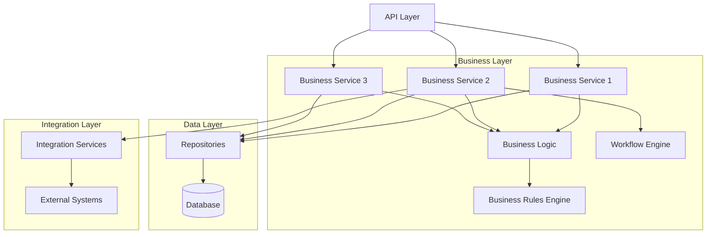

# Business Layer

The business layer contains the core business logic, orchestrates business processes, and enforces business rules. This section describes the technical implementation of business services and domain logic.

## Architecture Overview



## Technology Stack

| Component | Technology | Purpose |
|-----------|-----------|---------|
| **Application Framework** | [Spring Boot/Express/Django] | Service framework |
| **Language** | [Java/TypeScript/Python] | Implementation language |
| **Dependency Injection** | [Spring/InversifyJS/built-in] | IoC container |
| **ORM** | [Hibernate/TypeORM/SQLAlchemy] | Data access |
| **Validation** | [Bean Validation/class-validator] | Input validation |
| **Caching** | Redis | Performance optimization |
| **Message Queue** | [RabbitMQ/Kafka] | Async processing |

## Service Architecture

### Service Layer Structure

```
business-layer/
├── src/
│   ├── services/           # Business services
│   │   ├── UserService.ts
│   │   ├── OrderService.ts
│   │   └── PaymentService.ts
│   ├── domain/             # Domain models
│   │   ├── entities/       # Domain entities
│   │   ├── value-objects/  # Value objects
│   │   └── aggregates/     # Aggregate roots
│   ├── repositories/       # Data access interfaces
│   │   ├── interfaces/
│   │   └── implementations/
│   ├── workflows/          # Business workflows
│   ├── rules/              # Business rules
│   ├── validators/         # Business validators
│   ├── events/             # Domain events
│   └── exceptions/         # Business exceptions
├── tests/
│   ├── unit/
│   └── integration/
└── package.json
```

### Business Service Pattern

```typescript
// UserService.ts
import { Injectable } from '@framework/di';
import { UserRepository } from '../repositories/UserRepository';
import { EmailService } from '../integration/EmailService';
import { BusinessException } from '../exceptions/BusinessException';

@Injectable()
export class UserService {
  constructor(
    private readonly userRepository: UserRepository,
    private readonly emailService: EmailService
  ) {}

  async createUser(dto: CreateUserDto): Promise<User> {
    // 1. Validate business rules
    await this.validateUserCreation(dto);

    // 2. Create domain entity
    const user = new User({
      email: dto.email,
      name: dto.name,
      role: dto.role || 'USER'
    });

    // 3. Persist entity
    const savedUser = await this.userRepository.save(user);

    // 4. Trigger side effects
    await this.emailService.sendWelcomeEmail(savedUser.email);

    // 5. Publish domain event
    this.eventBus.publish(new UserCreatedEvent(savedUser));

    return savedUser;
  }

  async getUserById(id: string): Promise<User> {
    // Check cache first
    const cached = await this.cache.get(`user:${id}`);
    if (cached) return cached;

    // Fetch from database
    const user = await this.userRepository.findById(id);
    if (!user) {
      throw new NotFoundException(`User with ID ${id} not found`);
    }

    // Cache result
    await this.cache.set(`user:${id}`, user, 300); // 5 minutes TTL

    return user;
  }

  async updateUser(id: string, dto: UpdateUserDto): Promise<User> {
    // 1. Fetch existing user
    const user = await this.getUserById(id);

    // 2. Validate update
    await this.validateUserUpdate(user, dto);

    // 3. Apply changes
    user.update(dto);

    // 4. Persist changes
    const updatedUser = await this.userRepository.save(user);

    // 5. Invalidate cache
    await this.cache.delete(`user:${id}`);

    // 6. Publish domain event
    this.eventBus.publish(new UserUpdatedEvent(updatedUser));

    return updatedUser;
  }

  private async validateUserCreation(dto: CreateUserDto): Promise<void> {
    // Check if email already exists
    const existing = await this.userRepository.findByEmail(dto.email);
    if (existing) {
      throw new BusinessException('Email already in use');
    }

    // Validate email format
    if (!this.isValidEmail(dto.email)) {
      throw new ValidationException('Invalid email format');
    }

    // Apply business rules
    await this.businessRules.validate('user.create', dto);
  }

  private async validateUserUpdate(user: User, dto: UpdateUserDto): Promise<void> {
    // Business rule: Cannot change email
    if (dto.email && dto.email !== user.email) {
      throw new BusinessException('Email cannot be changed');
    }

    // Apply business rules
    await this.businessRules.validate('user.update', { user, dto });
  }
}
```

## Domain Model

### Domain Entities

```typescript
// domain/entities/User.ts
import { Entity } from '../common/Entity';
import { Email } from '../value-objects/Email';

export class User extends Entity {
  private _email: Email;
  private _name: string;
  private _role: UserRole;
  private _status: UserStatus;
  private _createdAt: Date;
  private _updatedAt: Date;

  constructor(props: UserProps) {
    super(props.id);
    this._email = new Email(props.email);
    this._name = props.name;
    this._role = props.role;
    this._status = props.status || UserStatus.ACTIVE;
    this._createdAt = props.createdAt || new Date();
    this._updatedAt = props.updatedAt || new Date();
  }

  // Getters
  get email(): string {
    return this._email.value;
  }

  get name(): string {
    return this._name;
  }

  get role(): UserRole {
    return this._role;
  }

  get status(): UserStatus {
    return this._status;
  }

  // Business methods
  activate(): void {
    if (this._status === UserStatus.ACTIVE) {
      throw new BusinessException('User is already active');
    }
    this._status = UserStatus.ACTIVE;
    this._updatedAt = new Date();
  }

  deactivate(): void {
    if (this._status === UserStatus.INACTIVE) {
      throw new BusinessException('User is already inactive');
    }
    this._status = UserStatus.INACTIVE;
    this._updatedAt = new Date();
  }

  update(dto: UpdateUserDto): void {
    if (dto.name) {
      this._name = dto.name;
    }
    if (dto.role) {
      this.changeRole(dto.role);
    }
    this._updatedAt = new Date();
  }

  private changeRole(newRole: UserRole): void {
    // Business rule: Super admin cannot change their own role
    if (this._role === UserRole.SUPER_ADMIN) {
      throw new BusinessException('Super admin role cannot be changed');
    }
    this._role = newRole;
  }

  // Validation
  isValid(): boolean {
    return this._email.isValid() && this._name.length > 0;
  }

  // Convert to plain object for persistence
  toObject(): Record<string, any> {
    return {
      id: this.id,
      email: this._email.value,
      name: this._name,
      role: this._role,
      status: this._status,
      createdAt: this._createdAt,
      updatedAt: this._updatedAt
    };
  }
}
```

### Value Objects

```typescript
// domain/value-objects/Email.ts
export class Email {
  private readonly _value: string;

  constructor(value: string) {
    if (!this.validate(value)) {
      throw new InvalidEmailException(value);
    }
    this._value = value.toLowerCase().trim();
  }

  get value(): string {
    return this._value;
  }

  isValid(): boolean {
    return this.validate(this._value);
  }

  private validate(email: string): boolean {
    const emailRegex = /^[^\s@]+@[^\s@]+\.[^\s@]+$/;
    return emailRegex.test(email);
  }

  equals(other: Email): boolean {
    return this._value === other._value;
  }
}
```

## Business Rules Engine

### Rule Definition

```typescript
// rules/BusinessRule.ts
export interface BusinessRule {
  name: string;
  description: string;
  validate(context: any): Promise<ValidationResult>;
}

export interface ValidationResult {
  isValid: boolean;
  errors: string[];
}

// Example Rule
export class UserEmailUniquenessRule implements BusinessRule {
  name = 'user.email.unique';
  description = 'User email must be unique';

  constructor(private userRepository: UserRepository) {}

  async validate(context: { email: string }): Promise<ValidationResult> {
    const existingUser = await this.userRepository.findByEmail(context.email);

    if (existingUser) {
      return {
        isValid: false,
        errors: ['Email is already in use']
      };
    }

    return {
      isValid: true,
      errors: []
    };
  }
}
```

### Rule Engine

```typescript
// rules/RuleEngine.ts
export class BusinessRuleEngine {
  private rules: Map<string, BusinessRule[]> = new Map();

  register(operation: string, rule: BusinessRule): void {
    if (!this.rules.has(operation)) {
      this.rules.set(operation, []);
    }
    this.rules.get(operation)!.push(rule);
  }

  async validate(operation: string, context: any): Promise<void> {
    const rules = this.rules.get(operation) || [];

    const results = await Promise.all(
      rules.map(rule => rule.validate(context))
    );

    const errors = results
      .filter(result => !result.isValid)
      .flatMap(result => result.errors);

    if (errors.length > 0) {
      throw new BusinessRuleViolationException(errors);
    }
  }
}
```

## Workflow Orchestration

### Workflow Example

```typescript
// workflows/OrderProcessingWorkflow.ts
export class OrderProcessingWorkflow {
  constructor(
    private orderService: OrderService,
    private paymentService: PaymentService,
    private inventoryService: InventoryService,
    private notificationService: NotificationService
  ) {}

  async execute(orderId: string): Promise<void> {
    try {
      // Step 1: Validate order
      const order = await this.orderService.getOrder(orderId);
      await this.validateOrder(order);

      // Step 2: Reserve inventory
      await this.inventoryService.reserve(order.items);

      try {
        // Step 3: Process payment
        const payment = await this.paymentService.process({
          orderId: order.id,
          amount: order.total
        });

        // Step 4: Confirm order
        await this.orderService.confirm(orderId, payment.id);

        // Step 5: Send confirmation
        await this.notificationService.sendOrderConfirmation(order);

      } catch (paymentError) {
        // Payment failed - rollback inventory reservation
        await this.inventoryService.release(order.items);
        await this.orderService.markAsFailed(orderId, paymentError.message);
        throw paymentError;
      }

    } catch (error) {
      // Log error and handle
      logger.error('Order processing failed', { orderId, error });
      throw error;
    }
  }

  private async validateOrder(order: Order): Promise<void> {
    if (order.items.length === 0) {
      throw new BusinessException('Order has no items');
    }

    if (order.total <= 0) {
      throw new BusinessException('Order total must be greater than 0');
    }

    // Additional validations...
  }
}
```

## Transaction Management

### Transaction Pattern

```typescript
// Using transactions for data consistency
@Transactional()
async transferFunds(
  fromAccountId: string,
  toAccountId: string,
  amount: number
): Promise<void> {
  // All operations within this method are in a single transaction
  const fromAccount = await this.accountRepository.findById(fromAccountId);
  const toAccount = await this.accountRepository.findById(toAccountId);

  // Validate business rules
  if (fromAccount.balance < amount) {
    throw new InsufficientFundsException();
  }

  // Debit from source
  fromAccount.debit(amount);
  await this.accountRepository.save(fromAccount);

  // Credit to destination
  toAccount.credit(amount);
  await this.accountRepository.save(toAccount);

  // Create transaction record
  const transaction = new Transaction({
    fromAccountId,
    toAccountId,
    amount,
    type: 'TRANSFER'
  });
  await this.transactionRepository.save(transaction);

  // If any operation fails, entire transaction is rolled back
}
```

## Error Handling

### Business Exceptions

```typescript
// exceptions/BusinessException.ts
export class BusinessException extends Error {
  constructor(
    message: string,
    public code: string = 'BUSINESS_ERROR',
    public details?: any
  ) {
    super(message);
    this.name = 'BusinessException';
  }
}

export class ValidationException extends BusinessException {
  constructor(message: string, public errors: ValidationError[]) {
    super(message, 'VALIDATION_ERROR');
    this.name = 'ValidationException';
  }
}

export class NotFoundException extends BusinessException {
  constructor(message: string) {
    super(message, 'NOT_FOUND');
    this.name = 'NotFoundException';
  }
}

export class BusinessRuleViolationException extends BusinessException {
  constructor(public violations: string[]) {
    super('Business rule violation', 'BUSINESS_RULE_VIOLATION');
    this.name = 'BusinessRuleViolationException';
  }
}
```

## Event-Driven Architecture

### Domain Events

```typescript
// events/DomainEvent.ts
export interface DomainEvent {
  eventId: string;
  eventType: string;
  aggregateId: string;
  occurredAt: Date;
  payload: any;
}

// events/UserEvents.ts
export class UserCreatedEvent implements DomainEvent {
  eventId: string;
  eventType = 'user.created';
  aggregateId: string;
  occurredAt: Date;

  constructor(public payload: User) {
    this.eventId = generateUUID();
    this.aggregateId = payload.id;
    this.occurredAt = new Date();
  }
}
```

### Event Bus

```typescript
// events/EventBus.ts
export class EventBus {
  private handlers: Map<string, EventHandler[]> = new Map();

  subscribe(eventType: string, handler: EventHandler): void {
    if (!this.handlers.has(eventType)) {
      this.handlers.set(eventType, []);
    }
    this.handlers.get(eventType)!.push(handler);
  }

  async publish(event: DomainEvent): Promise<void> {
    const handlers = this.handlers.get(event.eventType) || [];

    await Promise.all(
      handlers.map(handler => handler.handle(event))
    );
  }
}

// Example Event Handler
export class SendWelcomeEmailHandler implements EventHandler {
  constructor(private emailService: EmailService) {}

  async handle(event: UserCreatedEvent): Promise<void> {
    const user = event.payload;
    await this.emailService.sendWelcomeEmail(user.email);
  }
}
```

## Testing

### Unit Testing

```typescript
// tests/unit/UserService.test.ts
describe('UserService', () => {
  let userService: UserService;
  let userRepository: jest.Mocked<UserRepository>;
  let emailService: jest.Mocked<EmailService>;

  beforeEach(() => {
    userRepository = createMock<UserRepository>();
    emailService = createMock<EmailService>();
    userService = new UserService(userRepository, emailService);
  });

  describe('createUser', () => {
    it('should create a new user', async () => {
      const dto = {
        email: 'test@example.com',
        name: 'Test User'
      };

      userRepository.findByEmail.mockResolvedValue(null);
      userRepository.save.mockResolvedValue(new User(dto));

      const result = await userService.createUser(dto);

      expect(result.email).toBe(dto.email);
      expect(userRepository.save).toHaveBeenCalled();
      expect(emailService.sendWelcomeEmail).toHaveBeenCalledWith(dto.email);
    });

    it('should throw error if email already exists', async () => {
      const dto = {
        email: 'existing@example.com',
        name: 'Test User'
      };

      userRepository.findByEmail.mockResolvedValue(new User(dto));

      await expect(userService.createUser(dto))
        .rejects
        .toThrow('Email already in use');
    });
  });
});
```

---

:::tip Best Practices
- Keep business logic in the domain layer, not in controllers or repositories
- Use domain events for loose coupling between bounded contexts
- Apply SOLID principles and design patterns
- Write comprehensive unit tests for business logic
:::
