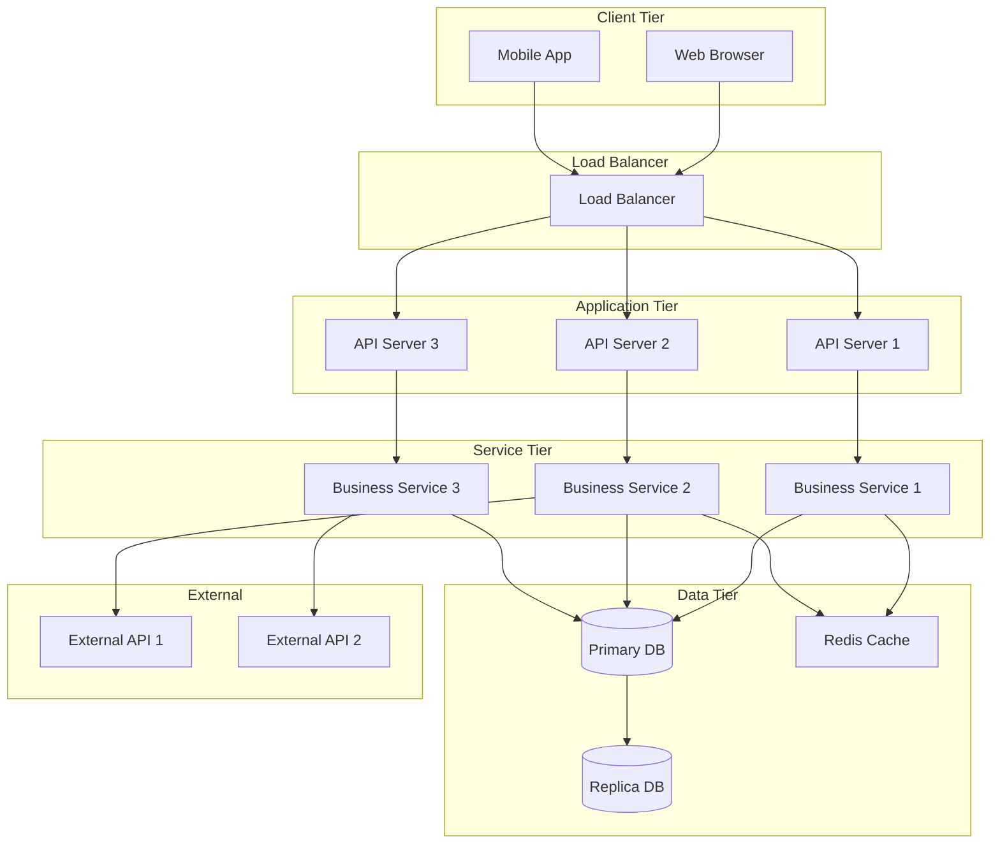

# Detailed Architecture

This section provides detailed technical specifications for the solution architecture, including technology choices, component designs, interfaces, and implementation details.

## Overview

The detailed architecture translates the logical architecture into concrete technical specifications, providing implementation guidance for development teams.

## Architecture Sections

### Technical Context

Detailed information about the technical environment, infrastructure, and technology stack.

[See Technical Context →](./technical-context.md)

### Interface Inventory

Catalog of all system interfaces, both internal and external.

[See Interface Inventory →](./interface-inventory/index.md)

### Presentation Layer

Technical details of the user interface and API layer implementation.

[See Presentation Layer →](./presentation-layer.md)

### Business Layer

Technical implementation details of business logic and services.

[See Business Layer →](./business-layer.md)

## Technical Architecture Diagram

## Technology Stack

### Frontend Technologies

| Technology | Version | Purpose | Justification |
|-----------|---------|---------|---------------|
| **[Framework]** | [Version] | UI framework | [Reason for choice] |
| **[Library]** | [Version] | State management | [Reason for choice] |
| **[Tool]** | [Version] | Build tool | [Reason for choice] |

### Backend Technologies

| Technology | Version | Purpose | Justification |
|-----------|---------|---------|---------------|
| **[Language]** | [Version] | Application development | [Reason for choice] |
| **[Framework]** | [Version] | Web framework | [Reason for choice] |
| **[Runtime]** | [Version] | Execution environment | [Reason for choice] |

### Data Technologies

| Technology | Version | Purpose | Justification |
|-----------|---------|---------|---------------|
| **[Database]** | [Version] | Primary data store | [Reason for choice] |
| **[Cache]** | [Version] | Caching layer | [Reason for choice] |
| **[Search]** | [Version] | Search engine | [Reason for choice] |

### Infrastructure Technologies

| Technology | Version | Purpose | Justification |
|-----------|---------|---------|---------------|
| **[Container]** | [Version] | Containerization | [Reason for choice] |
| **[Orchestration]** | [Version] | Container orchestration | [Reason for choice] |
| **[Cloud]** | [Version] | Cloud platform | [Reason for choice] |

## Deployment Architecture

### Environment Architecture

### Infrastructure Requirements

#### Development Environment

- **Servers:** [Specifications]
- **Database:** [Specifications]
- **Storage:** [Requirements]
- **Network:** [Requirements]

#### Production Environment

- **Servers:** [Specifications]
- **Database:** [Specifications]
- **Storage:** [Requirements]
- **Network:** [Requirements]
- **Redundancy:** [High availability setup]

## Component Details

### Component 1: [Component Name]

**Purpose:** [Description of component purpose]

**Technology:** [Specific technology used]

**Interfaces:**
- **Input:** [What it receives]
- **Output:** [What it produces]

**Dependencies:**
- [Dependency 1]
- [Dependency 2]

**Configuration:**
- [Key configuration parameters]

**Deployment:**
- [How it's deployed]
- [Scaling strategy]

### Component 2: [Component Name]

**Purpose:** [Description of component purpose]

**Technology:** [Specific technology used]

**Interfaces:**
- **Input:** [What it receives]
- **Output:** [What it produces]

**Dependencies:**
- [Dependency 1]
- [Dependency 2]

## Data Architecture

### Data Model Overview

### Data Storage

**Primary Database:**
- **Type:** [Relational/NoSQL]
- **Technology:** [Specific database]
- **Schema Management:** [Approach]
- **Backup Strategy:** [Frequency and retention]

**Caching Layer:**
- **Technology:** [Cache technology]
- **Strategy:** [What is cached and for how long]
- **Eviction Policy:** [How cache is invalidated]

**File Storage:**
- **Technology:** [Storage solution]
- **Purpose:** [What files are stored]
- **Retention:** [How long files are kept]

## Security Implementation

### Authentication

- **Method:** [OAuth 2.0, JWT, etc.]
- **Token Management:** [How tokens are issued and validated]
- **Session Management:** [How sessions are handled]

### Authorization

- **Model:** [RBAC, ABAC, etc.]
- **Implementation:** [How authorization is enforced]
- **Permissions:** [How permissions are defined]

### Data Protection

- **Encryption at Rest:** [Implementation details]
- **Encryption in Transit:** [TLS configuration]
- **Key Management:** [How encryption keys are managed]
- **Sensitive Data Handling:** [How PII and sensitive data is protected]

## Monitoring and Observability

### Logging

- **Logging Framework:** [Technology]
- **Log Aggregation:** [Centralized logging solution]
- **Log Retention:** [How long logs are kept]
- **Log Levels:** [What is logged at each level]

### Monitoring

- **APM Tool:** [Application Performance Monitoring tool]
- **Infrastructure Monitoring:** [Server/container monitoring]
- **Business Metrics:** [Custom business metrics tracked]

### Alerting

- **Alert Rules:** [What triggers alerts]
- **Notification Channels:** [How alerts are sent]
- **On-call Schedule:** [Who responds to alerts]

## Performance Characteristics

### Expected Performance

| Metric | Target | Load Condition |
|--------|--------|----------------|
| **API Response Time** | < 200ms | Normal load |
| **Page Load Time** | < 2 seconds | Normal load |
| **Throughput** | 1000 TPS | Peak load |
| **Database Query Time** | < 100ms | 95th percentile |
| **Cache Hit Rate** | > 80% | Normal operation |

### Capacity Planning

- **Current Capacity:** [Current system capacity]
- **Growth Projection:** [Expected growth rate]
- **Scaling Triggers:** [When to scale up/out]
- **Maximum Capacity:** [System limitations]

## Disaster Recovery

### Backup Strategy

- **Frequency:** Daily incremental, weekly full
- **Retention:** 30 days online, 1 year archived
- **Testing:** Monthly backup restoration tests
- **Storage:** [Where backups are stored]

### Recovery Procedures

- **RTO:** 4 hours
- **RPO:** 1 hour
- **Failover:** [Failover procedures]
- **Recovery:** [Step-by-step recovery process]

---

:::tip Implementation Guidance
The following subsections provide detailed specifications for each architectural layer and component.
:::
