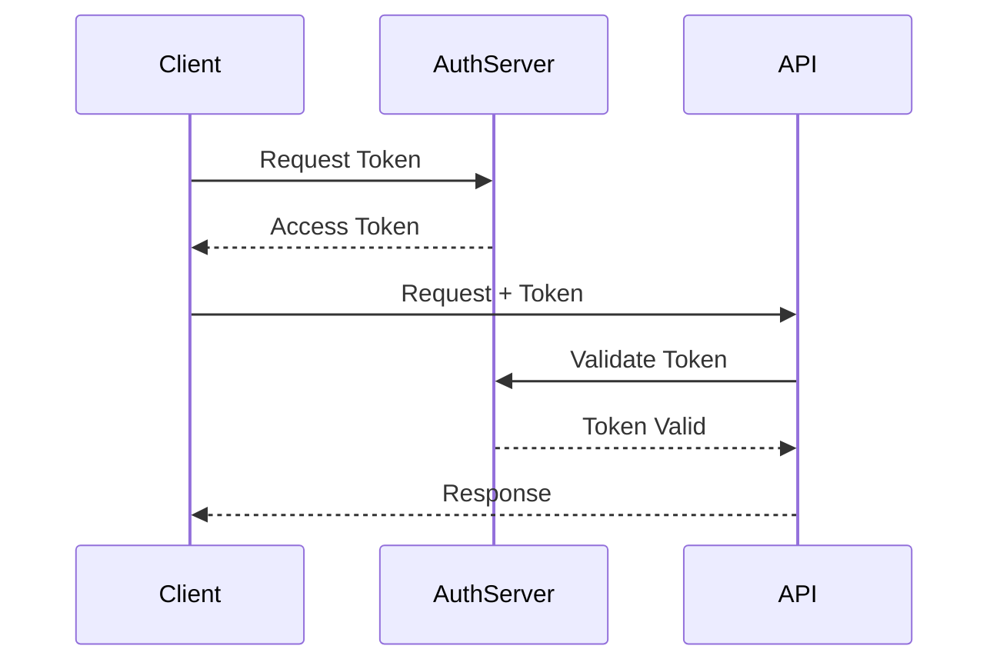

# Interface 1: [Interface Name]

## Overview

**Interface ID:** IF-001

**Interface Name:** [Descriptive name of the interface]

**Purpose:** [Brief description of what this interface does and why it exists]

**Type:** [External/Internal] [Synchronous/Asynchronous]

**Status:** Active / In Development / Deprecated

## Interface Details

### Provider and Consumer

| Role | System/Component | Description |
|------|-----------------|-------------|
| **Provider** | [System name] | [System that provides the service] |
| **Consumer** | [System name] | [System that consumes the service] |

### Technical Specifications

| Specification | Value |
|--------------|-------|
| **Protocol** | REST / SOAP / GraphQL / gRPC |
| **Transport** | HTTPS |
| **Port** | 443 |
| **Base URL** | `https://api.example.com/v1` |
| **Content Type** | application/json |
| **Character Encoding** | UTF-8 |

## Authentication and Authorization

### Authentication Method

**Method:** [OAuth 2.0 / API Key / JWT / mTLS]

**Authentication Flow:**



**Token Acquisition:**
```http
POST /oauth/token
Content-Type: application/x-www-form-urlencoded

grant_type=client_credentials
&client_id={client_id}
&client_secret={client_secret}
&scope={scope}
```

**Token Usage:**
```http
GET /api/v1/resource
Authorization: Bearer {access_token}
```

### Authorization

**Authorization Model:** [RBAC / ABAC / Scope-based]

**Required Scopes/Permissions:**
- `read:resources` - Read access to resources
- `write:resources` - Write access to resources
- `delete:resources` - Delete access to resources

## API Endpoints

### Endpoint 1: Get Resource

**HTTP Method:** GET

**Path:** `/api/v1/resources/{id}`

**Description:** Retrieves a single resource by ID

**Path Parameters:**

| Parameter | Type | Required | Description |
|-----------|------|----------|-------------|
| `id` | string | Yes | Unique identifier of the resource |

**Query Parameters:**

| Parameter | Type | Required | Description | Default |
|-----------|------|----------|-------------|---------|
| `include` | string | No | Related resources to include | none |
| `fields` | string | No | Specific fields to return | all |

**Request Example:**
```http
GET /api/v1/resources/123?include=related&fields=id,name
Authorization: Bearer {token}
Accept: application/json
```

**Response Example (200 OK):**
```json
{
  "data": {
    "id": "123",
    "type": "resource",
    "attributes": {
      "name": "Resource Name",
      "description": "Resource description",
      "createdAt": "2024-01-01T00:00:00Z",
      "updatedAt": "2024-01-01T00:00:00Z"
    },
    "relationships": {
      "related": {
        "data": [
          { "id": "456", "type": "related-resource" }
        ]
      }
    }
  }
}
```

**Error Responses:**

| Status Code | Description | Example |
|------------|-------------|---------|
| 400 | Bad Request | Invalid parameters |
| 401 | Unauthorized | Missing or invalid token |
| 403 | Forbidden | Insufficient permissions |
| 404 | Not Found | Resource does not exist |
| 500 | Internal Server Error | Server error |

**Error Response Example (404):**
```json
{
  "error": {
    "code": "RESOURCE_NOT_FOUND",
    "message": "Resource with ID 123 not found",
    "details": {
      "resourceId": "123",
      "resourceType": "resource"
    }
  },
  "meta": {
    "requestId": "req-uuid-123",
    "timestamp": "2024-01-01T00:00:00Z"
  }
}
```

### Endpoint 2: Create Resource

**HTTP Method:** POST

**Path:** `/api/v1/resources`

**Description:** Creates a new resource

**Request Headers:**
```http
Content-Type: application/json
Authorization: Bearer {token}
```

**Request Body:**
```json
{
  "data": {
    "type": "resource",
    "attributes": {
      "name": "New Resource",
      "description": "Resource description"
    }
  }
}
```

**Response Example (201 Created):**
```json
{
  "data": {
    "id": "789",
    "type": "resource",
    "attributes": {
      "name": "New Resource",
      "description": "Resource description",
      "createdAt": "2024-01-01T00:00:00Z",
      "updatedAt": "2024-01-01T00:00:00Z"
    }
  }
}
```

### Endpoint 3: Update Resource

**HTTP Method:** PUT / PATCH

**Path:** `/api/v1/resources/{id}`

**Description:** Updates an existing resource

### Endpoint 4: Delete Resource

**HTTP Method:** DELETE

**Path:** `/api/v1/resources/{id}`

**Description:** Deletes a resource

## Data Models

### Resource Data Model

```typescript
interface Resource {
  id: string;
  type: 'resource';
  attributes: {
    name: string;
    description: string;
    status: 'active' | 'inactive' | 'pending';
    createdAt: string; // ISO 8601 datetime
    updatedAt: string; // ISO 8601 datetime
  };
  relationships?: {
    [key: string]: {
      data: ResourceIdentifier[];
    };
  };
}

interface ResourceIdentifier {
  id: string;
  type: string;
}
```

### Validation Rules

| Field | Type | Constraints |
|-------|------|-------------|
| `name` | string | Required, 1-255 characters |
| `description` | string | Optional, max 1000 characters |
| `status` | enum | Required, one of: active, inactive, pending |

## Performance Characteristics

### Response Times (SLA)

| Endpoint | Target | 95th Percentile |
|----------|--------|-----------------|
| GET (single) | < 100ms | < 200ms |
| GET (list) | < 200ms | < 500ms |
| POST | < 300ms | < 600ms |
| PUT/PATCH | < 300ms | < 600ms |
| DELETE | < 200ms | < 400ms |

### Rate Limits

| Client Type | Rate Limit | Burst Limit |
|------------|------------|-------------|
| **Standard** | 1000 requests/hour | 50 requests/minute |
| **Premium** | 10000 requests/hour | 200 requests/minute |
| **Internal** | Unlimited | Unlimited |

**Rate Limit Headers:**
```http
X-RateLimit-Limit: 1000
X-RateLimit-Remaining: 999
X-RateLimit-Reset: 1640995200
```

### Pagination

For list endpoints, pagination is implemented:

**Request:**
```http
GET /api/v1/resources?page[number]=2&page[size]=20
```

**Response:**
```json
{
  "data": [...],
  "meta": {
    "totalRecords": 100,
    "totalPages": 5,
    "currentPage": 2,
    "pageSize": 20
  },
  "links": {
    "first": "/api/v1/resources?page[number]=1&page[size]=20",
    "prev": "/api/v1/resources?page[number]=1&page[size]=20",
    "next": "/api/v1/resources?page[number]=3&page[size]=20",
    "last": "/api/v1/resources?page[number]=5&page[size]=20"
  }
}
```

## Error Handling

### Error Codes

| Code | HTTP Status | Description | Retry |
|------|------------|-------------|-------|
| `VALIDATION_ERROR` | 400 | Invalid request parameters | No |
| `UNAUTHORIZED` | 401 | Missing or invalid authentication | No |
| `FORBIDDEN` | 403 | Insufficient permissions | No |
| `NOT_FOUND` | 404 | Resource not found | No |
| `CONFLICT` | 409 | Resource conflict | No |
| `RATE_LIMIT_EXCEEDED` | 429 | Too many requests | Yes, after reset |
| `SERVER_ERROR` | 500 | Internal server error | Yes, with backoff |
| `SERVICE_UNAVAILABLE` | 503 | Service temporarily unavailable | Yes, with backoff |

### Retry Strategy

For retriable errors (500, 503, 429):

1. Use exponential backoff: 1s, 2s, 4s, 8s
2. Maximum 3 retry attempts
3. Add jitter to prevent thundering herd

## Versioning

**Current Version:** v1

**Version Strategy:** URL-based versioning

**Backward Compatibility:** Guaranteed for at least 2 major versions

**Deprecation Policy:** 6-month notice before version retirement

## Testing

### Test Environment

**Base URL:** `https://api-test.example.com/v1`

**Test Credentials:**
- Client ID: `test-client-id`
- Client Secret: `test-client-secret`

### Sample Test Cases

1. **Successful Resource Retrieval**
   - Send: GET /api/v1/resources/123
   - Expect: 200 OK with resource data

2. **Resource Not Found**
   - Send: GET /api/v1/resources/invalid
   - Expect: 404 Not Found

3. **Unauthorized Access**
   - Send: GET /api/v1/resources/123 (no token)
   - Expect: 401 Unauthorized

## Monitoring and Support

### Monitoring

- **Availability:** 99.9% uptime SLA
- **Health Check Endpoint:** `GET /health`
- **Metrics Endpoint:** `GET /metrics` (internal only)

### Support Contacts

| Issue Type | Contact | Response Time |
|-----------|---------|---------------|
| **Production Issues** | [Email/Slack/PagerDuty] | < 1 hour |
| **Integration Questions** | [Email/Slack] | < 24 hours |
| **Feature Requests** | [Email/Ticket System] | < 1 week |

---

:::tip API Documentation
Interactive API documentation is available at: [Swagger/Postman URL]
:::

:::warning Breaking Changes
Any breaking changes to this interface will result in a new major version. Clients will be notified 6 months before old versions are deprecated.
:::
