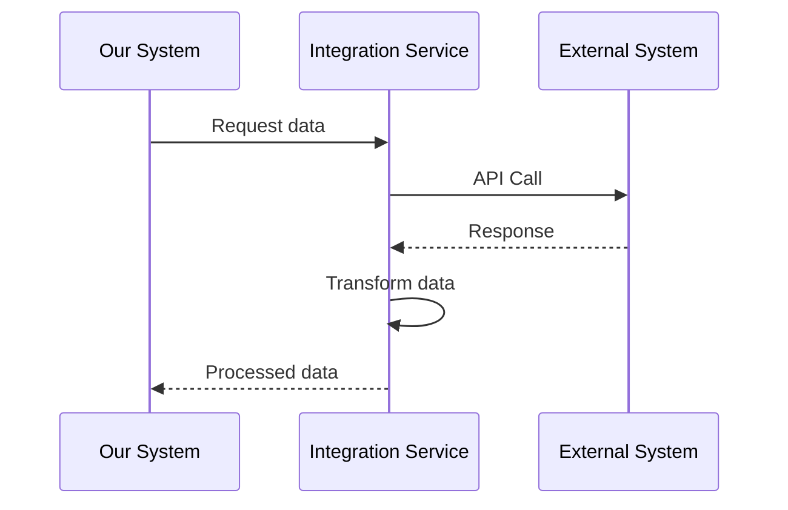

# Interface 2: [Interface Name]

## Overview

**Interface ID:** IF-002

**Interface Name:** [Descriptive name of the interface]

**Purpose:** [Brief description of what this interface does and why it exists]

**Type:** [External/Internal] [Synchronous/Asynchronous]

**Status:** Active / In Development / Deprecated

## Interface Details

### Provider and Consumer

| Role | System/Component | Description |
|------|-----------------|-------------|
| **Provider** | [External System name] | [System that provides the service] |
| **Consumer** | [This Solution] | [Our system consumes this service] |

### Technical Specifications

| Specification | Value |
|--------------|-------|
| **Protocol** | REST / SOAP / GraphQL / Message Queue |
| **Transport** | HTTPS / AMQP |
| **Port** | 443 / 5672 |
| **Endpoint URL** | `https://external-api.provider.com/v1` |
| **Content Type** | application/json / application/xml |
| **Character Encoding** | UTF-8 |

## Authentication and Authorization

### Authentication Method

**Method:** [API Key / OAuth 2.0 / mTLS / Basic Auth]

**Credentials Management:**
- Credentials stored in: [Secret Manager / Environment Variables]
- Rotation frequency: [90 days / As required]
- Access: [Limited to specific service accounts]

**Authentication Example:**
```http
GET /api/v1/external-resource
X-API-Key: {api_key}
X-API-Secret: {api_secret}
Accept: application/json
```

**OR OAuth 2.0:**
```http
POST /oauth/token
Content-Type: application/x-www-form-urlencoded

grant_type=client_credentials
&client_id={client_id}
&client_secret={client_secret}
```

## Integration Pattern

### Integration Type

**Pattern:** [Request-Response / Event-Driven / Batch / Polling]

**Integration Flow:**



### Error Handling

**Retry Strategy:**
- **Transient Errors (500, 503):** Retry with exponential backoff
  - Attempt 1: Immediate
  - Attempt 2: After 2 seconds
  - Attempt 3: After 4 seconds
  - Attempt 4: After 8 seconds
  - Max attempts: 4

- **Rate Limit (429):** Wait for rate limit reset

- **Non-Retriable Errors (400, 401, 403, 404):** Log and alert, no retry

**Circuit Breaker:**
- **Failure Threshold:** 5 consecutive failures
- **Open State Duration:** 60 seconds
- **Half-Open:** Allow 1 test request after timeout
- **Fallback:** Use cached data or return graceful error

## API Operations

### Operation 1: Retrieve External Data

**HTTP Method:** GET

**Endpoint:** `/api/v1/external-resource/{id}`

**Purpose:** Retrieve specific data from external system

**Request Parameters:**

| Parameter | Location | Type | Required | Description |
|-----------|----------|------|----------|-------------|
| `id` | path | string | Yes | Resource identifier |
| `expand` | query | string | No | Related data to include |

**Request Example:**
```http
GET /api/v1/external-resource/abc123?expand=details
X-API-Key: {api_key}
Accept: application/json
```

**Response Example (200 OK):**
```json
{
  "id": "abc123",
  "name": "External Resource",
  "status": "active",
  "data": {
    "field1": "value1",
    "field2": "value2"
  },
  "lastUpdated": "2024-01-01T00:00:00Z"
}
```

**Error Handling:**

| Status Code | Description | Action |
|------------|-------------|--------|
| 200 | Success | Process data |
| 404 | Not Found | Log warning, return null |
| 429 | Rate Limit | Wait and retry |
| 500 | Server Error | Retry with backoff |
| 503 | Service Unavailable | Retry with backoff |

### Operation 2: Submit Data to External System

**HTTP Method:** POST

**Endpoint:** `/api/v1/external-resource`

**Purpose:** Send data to external system for processing

**Request Body:**
```json
{
  "type": "transaction",
  "data": {
    "field1": "value1",
    "field2": "value2"
  },
  "metadata": {
    "source": "our-system",
    "timestamp": "2024-01-01T00:00:00Z"
  }
}
```

**Response Example (201 Created):**
```json
{
  "id": "def456",
  "status": "pending",
  "message": "Request received and queued for processing",
  "trackingId": "track-789"
}
```

### Operation 3: Check Status

**HTTP Method:** GET

**Endpoint:** `/api/v1/status/{trackingId}`

**Purpose:** Check the status of a submitted request

## Data Transformation

### Inbound Data Mapping

**External System Format → Our System Format**

```typescript
// External System Response
interface ExternalResponse {
  id: string;
  ext_name: string;
  ext_status: string;
  ext_data: {
    field_one: string;
    field_two: number;
  };
}

// Our System Format
interface OurFormat {
  externalId: string;
  name: string;
  status: 'active' | 'inactive';
  details: {
    fieldOne: string;
    fieldTwo: number;
  };
}

// Transformation Logic
function transform(external: ExternalResponse): OurFormat {
  return {
    externalId: external.id,
    name: external.ext_name,
    status: external.ext_status === 'ACTIVE' ? 'active' : 'inactive',
    details: {
      fieldOne: external.ext_data.field_one,
      fieldTwo: external.ext_data.field_two
    }
  };
}
```

### Outbound Data Mapping

**Our System Format → External System Format**

```typescript
// Our System Request
interface OurRequest {
  userId: string;
  action: string;
  payload: Record<string, any>;
}

// External System Expected Format
interface ExternalRequest {
  user_id: string;
  action_type: string;
  request_data: Record<string, any>;
  client_info: {
    client_id: string;
    timestamp: string;
  };
}
```

## Performance and Reliability

### Performance Characteristics

| Metric | Target | Typical | Maximum |
|--------|--------|---------|---------|
| **Response Time** | < 500ms | 200ms | 2000ms |
| **Throughput** | 100 req/s | 50 req/s | 200 req/s |
| **Availability** | 99.5% | 99.8% | - |

### Rate Limits

**External System Rate Limits:**
- **Standard Tier:** 1000 requests/hour
- **Burst Limit:** 50 requests/minute
- **Daily Quota:** 20,000 requests/day

**Our Implementation:**
- **Request Queue:** Queue requests if approaching limit
- **Rate Tracking:** Track API usage in Redis
- **Alert Threshold:** Alert at 80% of limit

### Caching Strategy

**Cache Policy:**
- **Cache Layer:** Redis
- **Cache Key Pattern:** `ext-api:{resource}:{id}`
- **TTL:** 5 minutes for frequently accessed data
- **Invalidation:** On explicit update or TTL expiry

**Cache Example:**
```typescript
async function getExternalResource(id: string) {
  const cacheKey = `ext-api:resource:${id}`;

  // Try cache first
  const cached = await redis.get(cacheKey);
  if (cached) {
    return JSON.parse(cached);
  }

  // Cache miss - call external API
  const data = await externalAPI.get(id);
  await redis.setex(cacheKey, 300, JSON.stringify(data));

  return data;
}
```

## Monitoring and Logging

### Monitoring Metrics

| Metric | Alert Threshold | Action |
|--------|----------------|--------|
| **Error Rate** | > 5% | Page on-call engineer |
| **Response Time** | > 1000ms (p95) | Investigate performance |
| **Circuit Breaker Open** | Any occurrence | Check external system status |
| **Rate Limit Approaching** | > 80% usage | Throttle non-critical requests |
| **API Down** | 3 consecutive failures | Alert and use fallback |

### Logging

**Log All API Calls:**
```typescript
{
  "timestamp": "2024-01-01T00:00:00Z",
  "level": "INFO",
  "service": "integration-service",
  "interface": "IF-002",
  "operation": "GET /external-resource/{id}",
  "requestId": "req-123",
  "duration": 245,
  "status": 200,
  "externalTrackingId": "ext-456"
}
```

**Log Errors:**
```typescript
{
  "timestamp": "2024-01-01T00:00:00Z",
  "level": "ERROR",
  "service": "integration-service",
  "interface": "IF-002",
  "operation": "POST /external-resource",
  "requestId": "req-789",
  "error": {
    "code": "EXTERNAL_API_ERROR",
    "message": "External API returned 500",
    "statusCode": 500,
    "retryAttempt": 2
  }
}
```

## Testing

### Test Environment

**Test Endpoint:** `https://external-api-test.provider.com/v1`

**Test Credentials:**
- API Key: `test-key-xxxxx`
- API Secret: `test-secret-xxxxx`

### Mock Responses

For development and testing:

```typescript
// Mock service for local development
const mockExternalAPI = {
  get: (id: string) => ({
    id,
    name: `Mock Resource ${id}`,
    status: 'active',
    data: { field1: 'test', field2: 42 }
  }),
  post: (data: any) => ({
    id: 'mock-id',
    status: 'pending',
    trackingId: 'mock-track-123'
  })
};
```

### Integration Tests

**Test Scenarios:**
1. ✓ Successful data retrieval
2. ✓ Handle 404 not found
3. ✓ Handle rate limiting (429)
4. ✓ Handle server errors (500, 503)
5. ✓ Circuit breaker activation
6. ✓ Cache hit scenario
7. ✓ Cache miss scenario
8. ✓ Data transformation correctness

## Operational Procedures

### Incident Response

**If External API is Down:**
1. Circuit breaker will open automatically
2. System falls back to cached data
3. Alert sent to integration team
4. Monitor external system status page
5. Circuit breaker auto-recovers when service restored

**If Rate Limit Exceeded:**
1. Non-critical requests queued
2. Critical requests continue with reduced frequency
3. Alert sent to review API usage patterns

### Maintenance Windows

**Scheduled Maintenance:**
- External system typically has maintenance: [Sunday 2AM-4AM ET]
- Our system should handle gracefully with cached data
- Non-critical batch jobs should avoid this window

## Documentation and Support

### External System Documentation

**Provider Documentation:** [Link to external API docs]

**Provider Support:**
- **Technical Support:** support@provider.com
- **API Status Page:** status.provider.com
- **API Updates:** Subscribe to API changelog

### Internal Documentation

**Integration Guide:** [Link to internal integration docs]

**Runbook:** [Link to operational runbook]

**Contact:** integration-team@ourcompany.com

---

:::warning External Dependency
This is a critical external dependency. Ensure fallback mechanisms are in place and regularly tested.
:::

:::tip API Changes
Subscribe to the external provider's API changelog to stay informed about changes, deprecations, and new features.
:::
