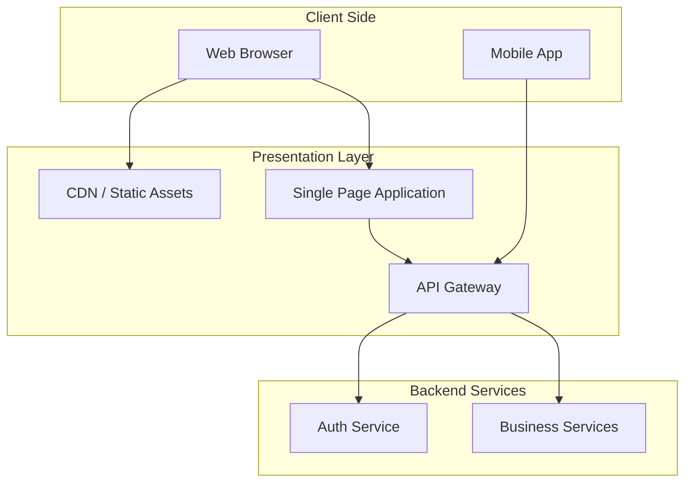
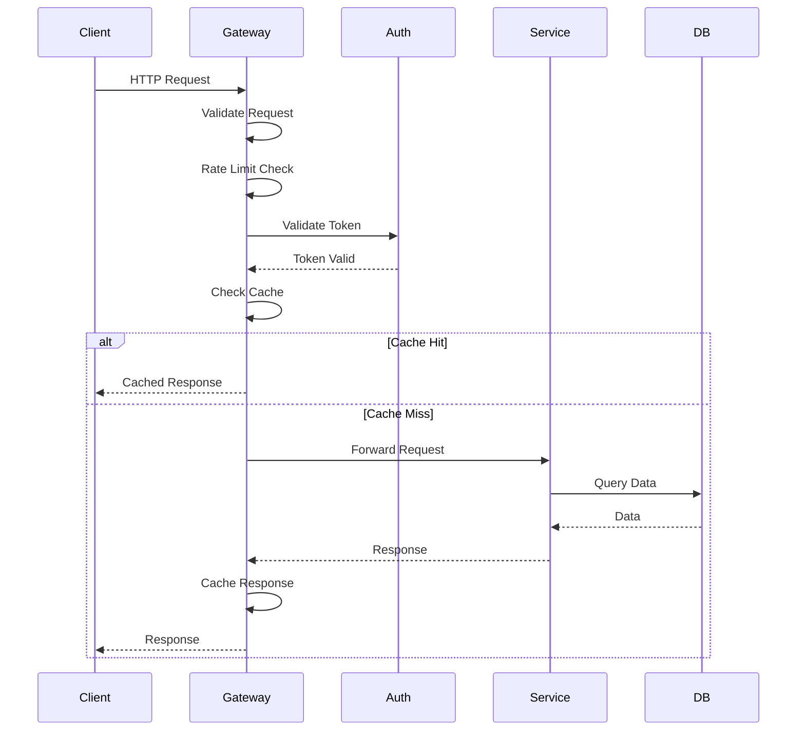

# Presentation Layer

The presentation layer is responsible for user interaction, displaying information, and handling user input. This section describes the technical implementation of the user interface and API gateway components.

## Architecture Overview



## Frontend Application

### Technology Stack

| Technology | Version | Purpose |
|-----------|---------|---------|
| **[Framework]** | [e.g., React 18.x] | UI framework |
| **[Language]** | TypeScript 5.x | Type-safe development |
| **[State Management]** | [Redux/Zustand/Context] | Application state |
| **[Routing]** | [React Router/Next.js] | Client-side routing |
| **[UI Library]** | [Material-UI/Tailwind/Custom] | UI components |
| **[Forms]** | [React Hook Form/Formik] | Form handling |
| **[HTTP Client]** | Axios | API communication |
| **[Build Tool]** | [Vite/Webpack] | Module bundler |

### Application Structure

```
frontend/
├── public/                 # Static assets
│   ├── index.html
│   ├── favicon.ico
│   └── images/
├── src/
│   ├── components/        # Reusable UI components
│   │   ├── common/       # Common components (Button, Input, etc.)
│   │   ├── layout/       # Layout components (Header, Footer, Sidebar)
│   │   └── features/     # Feature-specific components
│   ├── pages/            # Page components (route components)
│   ├── services/         # API service layer
│   ├── store/            # State management
│   ├── hooks/            # Custom React hooks
│   ├── utils/            # Utility functions
│   ├── types/            # TypeScript type definitions
│   ├── constants/        # Constants and configuration
│   ├── styles/           # Global styles
│   ├── App.tsx           # Root component
│   └── main.tsx          # Application entry point
├── tests/                # Test files
├── package.json
└── tsconfig.json
```

### Component Architecture

**Component Hierarchy:**

```typescript
// Base Component Pattern
interface BaseProps {
  className?: string;
  'data-testid'?: string;
}

// Example: Reusable Button Component
interface ButtonProps extends BaseProps {
  variant: 'primary' | 'secondary' | 'danger';
  size: 'small' | 'medium' | 'large';
  disabled?: boolean;
  loading?: boolean;
  onClick?: () => void;
  children: React.ReactNode;
}

export const Button: React.FC<ButtonProps> = ({
  variant,
  size,
  disabled,
  loading,
  onClick,
  children,
  className,
  ...props
}) => {
  // Component implementation
};
```

### State Management

**Global State Structure:**

```typescript
interface AppState {
  auth: {
    user: User | null;
    token: string | null;
    isAuthenticated: boolean;
  };
  ui: {
    theme: 'light' | 'dark';
    sidebarOpen: boolean;
    notifications: Notification[];
  };
  data: {
    // Domain-specific data
    resources: Resource[];
    loading: boolean;
    error: Error | null;
  };
}
```

**State Management Pattern:**

```typescript
// Actions
const actions = {
  setUser: (user: User) => ({ type: 'SET_USER', payload: user }),
  logout: () => ({ type: 'LOGOUT' }),
  fetchResources: () => async (dispatch: Dispatch) => {
    dispatch({ type: 'FETCH_RESOURCES_START' });
    try {
      const data = await api.getResources();
      dispatch({ type: 'FETCH_RESOURCES_SUCCESS', payload: data });
    } catch (error) {
      dispatch({ type: 'FETCH_RESOURCES_ERROR', payload: error });
    }
  }
};
```

### Routing

**Route Configuration:**

```typescript
const routes = [
  {
    path: '/',
    element: <Layout />,
    children: [
      { index: true, element: <HomePage /> },
      { path: 'dashboard', element: <DashboardPage /> },
      {
        path: 'resources',
        children: [
          { index: true, element: <ResourceListPage /> },
          { path: ':id', element: <ResourceDetailPage /> },
          { path: 'new', element: <ResourceCreatePage /> },
          { path: ':id/edit', element: <ResourceEditPage /> }
        ]
      },
      { path: 'settings', element: <SettingsPage /> }
    ]
  },
  {
    path: '/login',
    element: <LoginPage />
  },
  {
    path: '*',
    element: <NotFoundPage />
  }
];
```

**Protected Routes:**

```typescript
const ProtectedRoute: React.FC<{ children: React.ReactNode }> = ({ children }) => {
  const { isAuthenticated } = useAuth();
  return isAuthenticated ? <>{children}</> : <Navigate to="/login" />;
};
```

### API Integration

**API Service Layer:**

```typescript
// api/client.ts
import axios from 'axios';

const apiClient = axios.create({
  baseURL: import.meta.env.VITE_API_URL,
  timeout: 10000,
  headers: {
    'Content-Type': 'application/json'
  }
});

// Request interceptor
apiClient.interceptors.request.use(
  (config) => {
    const token = localStorage.getItem('token');
    if (token) {
      config.headers.Authorization = `Bearer ${token}`;
    }
    return config;
  },
  (error) => Promise.reject(error)
);

// Response interceptor
apiClient.interceptors.response.use(
  (response) => response,
  (error) => {
    if (error.response?.status === 401) {
      // Handle unauthorized
      window.location.href = '/login';
    }
    return Promise.reject(error);
  }
);

export default apiClient;
```

**API Service:**

```typescript
// services/resourceService.ts
import apiClient from './api/client';

export const resourceService = {
  getAll: async (): Promise<Resource[]> => {
    const response = await apiClient.get('/resources');
    return response.data.data;
  },

  getById: async (id: string): Promise<Resource> => {
    const response = await apiClient.get(`/resources/${id}`);
    return response.data.data;
  },

  create: async (data: CreateResourceDto): Promise<Resource> => {
    const response = await apiClient.post('/resources', { data });
    return response.data.data;
  },

  update: async (id: string, data: UpdateResourceDto): Promise<Resource> => {
    const response = await apiClient.put(`/resources/${id}`, { data });
    return response.data.data;
  },

  delete: async (id: string): Promise<void> => {
    await apiClient.delete(`/resources/${id}`);
  }
};
```

## API Gateway

### Technology Stack

| Component | Technology | Purpose |
|-----------|-----------|---------|
| **API Gateway** | [Kong/NGINX/AWS API Gateway] | Request routing, authentication |
| **Load Balancer** | [AWS ALB/NGINX] | Traffic distribution |
| **Rate Limiting** | Redis | API rate limiting |
| **Cache** | Redis | Response caching |

### API Gateway Responsibilities

1. **Request Routing**
   - Route requests to appropriate backend services
   - Load balancing across service instances
   - Path-based routing

2. **Authentication & Authorization**
   - Validate JWT tokens
   - Extract user information
   - Enforce access control policies

3. **Cross-Cutting Concerns**
   - Request/response logging
   - Metrics collection
   - Error handling
   - CORS configuration

4. **Protocol Translation**
   - HTTP to internal protocols if needed
   - WebSocket upgrade handling
   - GraphQL to REST translation (if applicable)

5. **Security**
   - SSL/TLS termination
   - Request validation
   - DDoS protection
   - IP whitelisting/blacklisting

### API Gateway Configuration

**Route Configuration:**

```yaml
routes:
  - name: auth-route
    paths:
      - /api/v1/auth
    methods: [POST]
    service: auth-service
    plugins:
      - name: rate-limiting
        config:
          minute: 10
          hour: 100

  - name: resources-route
    paths:
      - /api/v1/resources
    methods: [GET, POST, PUT, DELETE]
    service: business-service
    plugins:
      - name: jwt
      - name: rate-limiting
        config:
          minute: 100
          hour: 1000
      - name: response-cache
        config:
          ttl: 300
```

### Request/Response Pipeline



## UI/UX Patterns

### Design System

**Color Palette:**
- Primary: `#0066CC`
- Secondary: `#6C757D`
- Success: `#28A745`
- Warning: `#FFC107`
- Danger: `#DC3545`
- Info: `#17A2B8`

**Typography:**
- Font Family: Inter, -apple-system, BlinkMacSystemFont, Segoe UI
- Headings: 24px, 20px, 18px, 16px
- Body: 14px
- Small: 12px

**Spacing:**
- Base unit: 8px
- Scale: 4px, 8px, 16px, 24px, 32px, 48px, 64px

### Common UI Patterns

**Loading States:**
```typescript
const LoadingState: React.FC = () => (
  <div className="loading-spinner">
    <Spinner size="large" />
    <p>Loading...</p>
  </div>
);
```

**Error States:**
```typescript
const ErrorState: React.FC<{ error: Error; onRetry?: () => void }> = ({
  error,
  onRetry
}) => (
  <div className="error-state">
    <Icon name="error" />
    <h3>Something went wrong</h3>
    <p>{error.message}</p>
    {onRetry && <Button onClick={onRetry}>Retry</Button>}
  </div>
);
```

**Empty States:**
```typescript
const EmptyState: React.FC<{ message: string; action?: ReactNode }> = ({
  message,
  action
}) => (
  <div className="empty-state">
    <Icon name="inbox" />
    <p>{message}</p>
    {action}
  </div>
);
```

## Performance Optimization

### Code Splitting

```typescript
// Lazy load routes
const DashboardPage = lazy(() => import('./pages/DashboardPage'));
const ResourcePage = lazy(() => import('./pages/ResourcePage'));

// Use with Suspense
<Suspense fallback={<LoadingState />}>
  <Routes>
    <Route path="/dashboard" element={<DashboardPage />} />
    <Route path="/resources" element={<ResourcePage />} />
  </Routes>
</Suspense>
```

### Caching Strategies

- **Browser Cache:** Static assets cached with versioned filenames
- **API Cache:** GET requests cached in API Gateway (5 minutes)
- **Application Cache:** Frequently accessed data cached in state
- **Service Worker:** Offline capabilities (PWA)

### Bundle Optimization

- **Tree Shaking:** Remove unused code
- **Code Splitting:** Load code on demand
- **Asset Optimization:** Compress images, use WebP format
- **Minification:** Minify JS/CSS for production
- **Lazy Loading:** Load images and components lazily

## Security

### XSS Prevention

- Sanitize all user inputs
- Use React's built-in XSS protection
- Content Security Policy headers
- Avoid `dangerouslySetInnerHTML`

### CSRF Protection

- SameSite cookie attribute
- CSRF tokens for state-changing operations
- Verify Origin/Referer headers

### Authentication Flow

```typescript
// Login flow
async function login(email: string, password: string) {
  const response = await api.post('/auth/login', { email, password });
  const { token, user } = response.data;

  // Store token securely
  localStorage.setItem('token', token);

  // Update application state
  dispatch(setUser(user));

  // Redirect to dashboard
  navigate('/dashboard');
}

// Logout flow
function logout() {
  localStorage.removeItem('token');
  dispatch(clearUser());
  navigate('/login');
}
```

## Accessibility

### WCAG 2.1 Compliance

- Semantic HTML elements
- ARIA labels and roles
- Keyboard navigation support
- Focus management
- Screen reader support
- Color contrast ratios (4.5:1 minimum)

### Example:

```typescript
<button
  aria-label="Close dialog"
  aria-pressed={isOpen}
  onClick={handleClose}
>
  <Icon name="close" aria-hidden="true" />
</button>
```

---

:::tip Performance
Monitor frontend performance using tools like Lighthouse, WebPageTest, and Real User Monitoring (RUM).
:::
