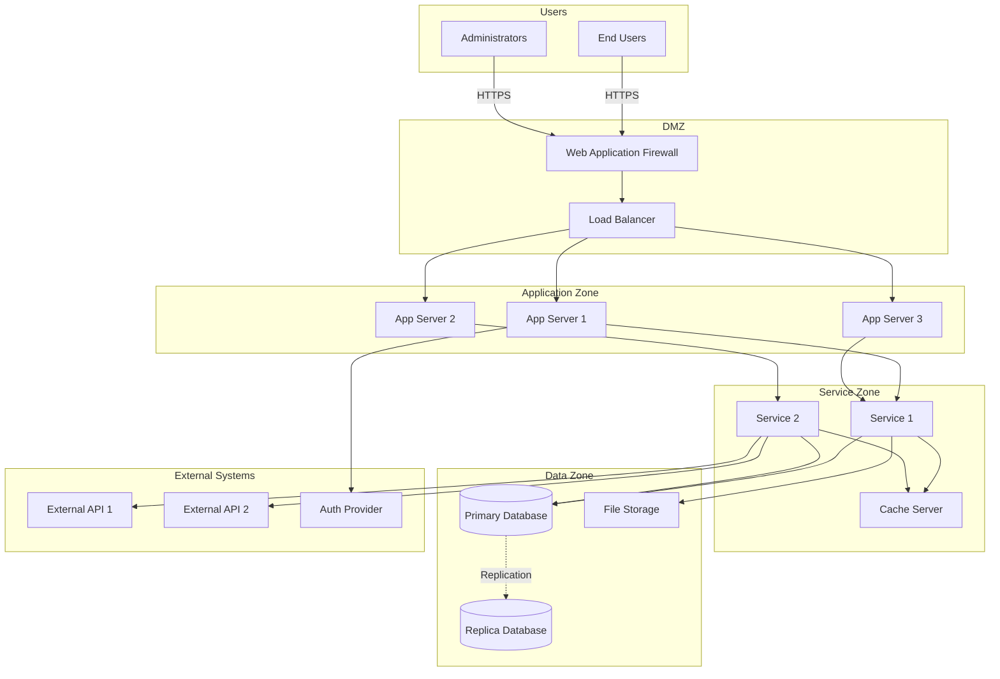
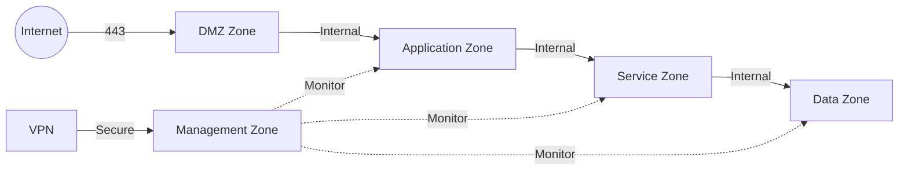
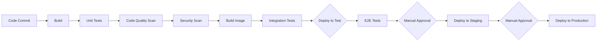

# Technical Context

This section describes the technical environment in which the solution operates, including infrastructure, deployment topology, and technical dependencies.

## Technical Context Diagram



## Infrastructure Overview

### Hosting Environment

**Environment Type:** [Cloud / On-Premises / Hybrid]

**Infrastructure Provider:** [AWS / Azure / GCP / On-prem data center]

**Deployment Model:**
- **Development:** [Single server / Small cluster]
- **Test:** [Similar to production but smaller scale]
- **Staging:** [Production-like environment]
- **Production:** [Multi-server, high availability]

### Network Architecture

#### Network Zones

| Zone | Purpose | Access | Components |
|------|---------|--------|------------|
| **DMZ** | Internet-facing layer | Public | WAF, Load Balancer |
| **Application Zone** | Application servers | Private | API Servers, Web Servers |
| **Service Zone** | Business services | Private | Business Services, Cache |
| **Data Zone** | Data storage | Highly restricted | Databases, File Storage |
| **Management Zone** | Administrative | Restricted | Monitoring, Logging, Backup |

#### Network Connectivity



**Firewall Rules:**
- Internet → DMZ: HTTPS (443) only
- DMZ → Application Zone: HTTP/HTTPS (80, 443)
- Application Zone → Service Zone: Internal protocols
- Service Zone → Data Zone: Database ports (restricted)
- Management Zone → All Zones: Monitoring ports (restricted)

### Compute Resources

#### Production Environment

| Component | Quantity | Specs | Purpose |
|-----------|----------|-------|---------|
| **Load Balancer** | 2 | [Specs] | Distribute traffic, HA |
| **Web/API Servers** | 3+ | [CPU/RAM/Storage] | Host application |
| **Business Service Servers** | 3+ | [CPU/RAM/Storage] | Run business logic |
| **Cache Servers** | 2 | [RAM optimized] | In-memory caching |
| **Database Servers** | 2 | [I/O optimized] | Primary + Replica |
| **File Storage** | 1 | [Storage optimized] | Document storage |

#### Scaling Strategy

- **Horizontal Scaling:** Add more application/service servers during peak load
- **Vertical Scaling:** Increase resources for database servers as data grows
- **Auto-scaling:** Configured based on CPU/memory thresholds
- **Scaling Triggers:**
  - CPU utilization > 70%
  - Memory utilization > 80%
  - Request queue length > 100

### Storage Resources

| Storage Type | Technology | Capacity | Purpose | Backup |
|-------------|-----------|----------|---------|---------|
| **Database** | [Technology] | [Initial capacity] | Transactional data | Daily incremental, weekly full |
| **Cache** | [Technology] | [Memory size] | Performance optimization | Not backed up |
| **File Storage** | [Technology] | [Initial capacity] | Documents, images | Daily backup |
| **Backup Storage** | [Technology] | [Capacity] | Backup retention | Replicated offsite |
| **Archive Storage** | [Technology] | [Capacity] | Long-term archives | Replicated offsite |

### Network Resources

| Resource | Configuration | Purpose |
|----------|--------------|---------|
| **Load Balancer** | Layer 7 (HTTP/HTTPS) | Traffic distribution, SSL termination |
| **Bandwidth** | [X Gbps] | Network connectivity |
| **CDN** | [Provider] | Static content delivery |
| **VPN** | IPSec/SSL VPN | Secure remote access |
| **DNS** | [Provider] | Domain name resolution |

## Technology Stack Details

### Frontend Stack

```
Technology Stack:
├── Framework: [React/Angular/Vue] [Version]
├── UI Library: [Material-UI/Bootstrap/Custom]
├── State Management: [Redux/MobX/Context API]
├── Build Tool: [Webpack/Vite/Rollup]
├── Testing: [Jest/Mocha/Cypress]
└── Package Manager: [npm/yarn/pnpm]
```

**Key Libraries:**
- **HTTP Client:** [axios/fetch]
- **Routing:** [react-router/vue-router]
- **Form Handling:** [Formik/React Hook Form]
- **Validation:** [Yup/Joi]
- **Date Handling:** [date-fns/moment]
- **Charts:** [Chart.js/D3.js]

### Backend Stack

```
Technology Stack:
├── Language: [Java/Python/Node.js/Go] [Version]
├── Framework: [Spring Boot/Django/Express/Gin]
├── API Style: REST / GraphQL
├── ORM: [Hibernate/SQLAlchemy/TypeORM/GORM]
├── Testing: [JUnit/pytest/Jest/Go test]
└── Package Manager: [Maven/pip/npm/go modules]
```

**Key Libraries:**
- **HTTP Framework:** [Express/Flask/Gin]
- **Authentication:** [Passport/JWT libraries]
- **Validation:** [Joi/class-validator]
- **Logging:** [Winston/Logrus]
- **Task Queue:** [Bull/Celery]

### Data Stack

```
Data Technologies:
├── Primary Database: [PostgreSQL/MySQL/MongoDB] [Version]
├── Cache: Redis [Version]
├── Search: [Elasticsearch] [Version]
├── Message Queue: [RabbitMQ/Kafka] [Version]
└── Object Storage: [S3/Azure Blob/MinIO]
```

**Database Configuration:**
- **Connection Pooling:** Min: [X], Max: [Y]
- **Replication:** Asynchronous/Synchronous
- **Backup Schedule:** Daily at [time]
- **Retention:** 30 days online, 365 days archive

### Infrastructure Stack

```
Infrastructure:
├── Containerization: Docker [Version]
├── Orchestration: Kubernetes [Version]
├── CI/CD: GitLab CI / Jenkins
├── Infrastructure as Code: Terraform / CloudFormation
├── Configuration Management: Ansible / Chef
├── Service Mesh: Istio / Linkerd (if applicable)
└── Monitoring: Prometheus + Grafana / Datadog
```

## Development Environment

### Local Development Setup

**Requirements:**
- **OS:** [Supported operating systems]
- **RAM:** Minimum 16GB recommended
- **Storage:** 50GB available space
- **Software:**
  - [Programming language and version]
  - [Docker Desktop]
  - [IDE recommendations]
  - [Database client tools]

**Setup Steps:**
1. Clone repository
2. Install dependencies
3. Configure environment variables
4. Start local services (database, cache, etc.)
5. Run application

**Local Services:**
```yaml
services:
  database:
    image: postgres:15
    port: 5432
  cache:
    image: redis:7
    port: 6379
  localstack:
    image: localstack/localstack
    ports: 4566
```

### CI/CD Pipeline



**Pipeline Stages:**

1. **Build Stage**
   - Compile code
   - Resolve dependencies
   - Generate artifacts

2. **Test Stage**
   - Unit tests (min 80% coverage)
   - Integration tests
   - E2E tests

3. **Quality Stage**
   - Static code analysis (SonarQube)
   - Security scanning (SAST/DAST)
   - Dependency vulnerability scanning

4. **Package Stage**
   - Build Docker images
   - Tag with version
   - Push to container registry

5. **Deploy Stage**
   - Deploy to target environment
   - Run smoke tests
   - Health checks

## External Dependencies

### Third-Party Services

| Service | Provider | Purpose | SLA | Fallback |
|---------|----------|---------|-----|----------|
| **Authentication** | [Provider] | User authentication | 99.9% | Local auth cache |
| **Payment Gateway** | [Provider] | Payment processing | 99.9% | Queue for retry |
| **Email Service** | [Provider] | Transactional emails | 99.5% | Queue for retry |
| **SMS Service** | [Provider] | SMS notifications | 99.5% | Queue for retry |
| **CDN** | [Provider] | Content delivery | 99.9% | Direct origin access |

### External APIs

| API | Version | Protocol | Authentication | Rate Limit |
|-----|---------|----------|----------------|------------|
| **External System A** | v2 | REST | OAuth 2.0 | 1000 req/min |
| **External System B** | v1 | SOAP | API Key | 500 req/min |
| **External System C** | v3 | GraphQL | JWT | 2000 req/min |

### Managed Services

| Service | Provider | Purpose | Configuration |
|---------|----------|---------|---------------|
| **Load Balancer** | [Cloud Provider] | Traffic distribution | [Config details] |
| **CDN** | [Provider] | Content delivery | [Config details] |
| **DNS** | [Provider] | Domain management | [Config details] |
| **Monitoring** | [Provider] | System monitoring | [Config details] |
| **Logging** | [Provider] | Log aggregation | [Config details] |

## Security Infrastructure

### Security Components

- **WAF (Web Application Firewall):** [Technology/Provider]
- **DDoS Protection:** [Technology/Provider]
- **IDS/IPS:** [Technology]
- **Vulnerability Scanner:** [Technology]
- **SIEM:** [Technology]
- **Secrets Management:** [HashiCorp Vault / Cloud KMS]

### SSL/TLS Configuration

- **Certificates:** [Certificate Authority]
- **Protocol:** TLS 1.3
- **Cipher Suites:** [Approved cipher suites]
- **Certificate Rotation:** Automated via [tool]

## Operational Tools

### Monitoring and Observability

| Tool | Purpose | Access |
|------|---------|--------|
| **Prometheus** | Metrics collection | Ops team |
| **Grafana** | Metrics visualization | All teams |
| **ELK Stack** | Log aggregation and search | All teams |
| **APM Tool** | Application performance | Dev and Ops |
| **Uptime Monitor** | Availability monitoring | Ops team |

### Management Tools

| Tool | Purpose | Access |
|------|---------|--------|
| **Kubernetes Dashboard** | Container orchestration UI | Ops team |
| **Database Admin Tool** | Database management | DBA team |
| **CI/CD Dashboard** | Pipeline monitoring | Dev team |
| **IaC Repository** | Infrastructure code | Ops team |

---

:::tip Environment Access
Access to production environments is restricted and requires approval through the change management process.
:::
