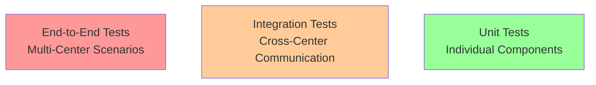

# Architectural Concerns for Multi-Processing Center Testing

This section outlines the specific architectural concerns, challenges, and testing strategies for validating multi-processing center functionality.

## Testing Challenges

### Complexity of Distributed Systems

Multi-processing center architectures introduce several testing challenges:

- **Network Latency:** Variable latency between centers
- **Partial Failures:** Some centers may fail while others remain operational
- **Data Inconsistency:** Temporary inconsistencies during replication
- **Clock Synchronization:** Time differences between centers
- **Concurrent Operations:** Same data modified in multiple centers simultaneously
- **Network Partitions:** Communication failures between centers

## Testing Strategy

### Test Pyramid for Multi-Center



**Test Distribution:**
- **Unit Tests:** 70% - Test individual components in isolation
- **Integration Tests:** 20% - Test interaction between centers
- **End-to-End Tests:** 10% - Test complete multi-center scenarios

### Test Environments

| Environment | Purpose | Configuration |
|------------|---------|---------------|
| **Local** | Development testing | Mock multi-center with docker-compose |
| **Dev** | Feature testing | 2 centers, small scale |
| **Test** | Integration testing | 2 centers, production-like |
| **Staging** | Pre-production | 3 centers, full scale |
| **Production** | Live system | Multiple centers globally |

## Test Scenarios

### Scenario 1: Normal Operation

**Objective:** Verify system operates correctly when all centers are healthy

**Test Cases:**
1. User in Center A reads data from Center A (local access)
2. User in Center A reads data created in Center B (cross-center access)
3. User in Center A writes data, verify it replicates to Center B
4. Concurrent writes to different centers don't conflict
5. Global load balancer distributes traffic appropriately

**Expected Results:**
- ✓ All requests succeed with acceptable latency
- ✓ Data is eventually consistent across centers
- ✓ No data loss or corruption
- ✓ Load distributed according to routing policy

### Scenario 2: Single Center Failure

**Objective:** Verify system continues operating when one center fails

**Test Steps:**
1. System operating normally with 3 centers
2. Simulate failure of Center B (stop all services)
3. Verify traffic redirects to Centers A and C
4. Perform read and write operations
5. Restore Center B
6. Verify data syncs to restored center
7. Verify traffic gradually returns to Center B

**Expected Results:**
- ✓ Automatic failover within defined RTO
- ✓ No requests fail during failover
- ✓ Data remains consistent
- ✓ Failed center automatically rejoins after recovery

### Scenario 3: Network Partition

**Objective:** Verify system behavior when centers cannot communicate

**Test Steps:**
1. System operating normally
2. Simulate network partition (Centers A+B vs Center C)
3. Perform operations in isolated groups
4. Restore network connectivity
5. Verify conflict resolution
6. Validate data consistency

**Expected Results:**
- ✓ Each partition continues operating independently
- ✓ No data loss in any partition
- ✓ Conflicts detected and resolved after partition heals
- ✓ System returns to normal state

### Scenario 4: Data Synchronization

**Objective:** Verify data synchronizes correctly across centers

**Test Cases:**
1. Create record in Center A, verify appears in Centers B and C
2. Update record in Center B, verify updates propagate
3. Delete record in Center C, verify deletion propagates
4. Concurrent updates to same record in different centers
5. Large batch of changes synchronizing

**Measurements:**
- Replication lag time
- Data consistency verification
- Conflict rate and resolution
- Bandwidth utilization

### Scenario 5: Failover and Recovery

**Objective:** Verify graceful failover and recovery procedures

**Test Steps:**
1. Mark Center A for maintenance
2. Drain traffic from Center A
3. Verify all traffic redirects to other centers
4. Perform maintenance (e.g., software upgrade)
5. Return Center A to service
6. Gradually restore traffic to Center A

**Expected Results:**
- ✓ Zero downtime during planned maintenance
- ✓ No failed requests
- ✓ Data remains synchronized
- ✓ Smooth return to normal operations

### Scenario 6: Geographic Routing

**Objective:** Verify users route to appropriate processing center

**Test Cases:**
1. User in US routes to US center
2. User in Europe routes to EU center
3. User in Asia routes to Asia center
4. Verify fallback when nearest center unavailable
5. Verify latency-based routing works correctly

**Measurements:**
- Routing accuracy (% correctly routed)
- Average latency per region
- Failover response time

## Performance Testing

### Load Testing Across Centers

**Scenario:** Simulate realistic load across multiple centers

```typescript
// Load test configuration
const loadTest = {
  centers: ['us-east', 'eu-west', 'ap-south'],
  virtualUsers: {
    'us-east': 1000,
    'eu-west': 800,
    'ap-south': 500
  },
  duration: '30m',
  rampUp: '5m',
  scenarios: [
    {
      name: 'read-local-data',
      weight: 70,
      exec: readLocalData
    },
    {
      name: 'read-remote-data',
      weight: 20,
      exec: readRemoteData
    },
    {
      name: 'write-data',
      weight: 10,
      exec: writeData
    }
  ]
};
```

**Metrics to Monitor:**
- Throughput per center
- Response time percentiles (p50, p95, p99)
- Error rate per center
- Cross-center latency
- Database connection pool utilization
- Cache hit rate

### Stress Testing

**Objective:** Test system beyond normal capacity

**Test Cases:**
1. Gradually increase load until system reaches breaking point
2. Verify graceful degradation
3. Test recovery after stress removed
4. Verify no permanent damage to data

**Expected Results:**
- System handles 2x normal load
- Graceful degradation at 3x load
- Auto-recovery after load reduced
- No data corruption

## Chaos Engineering

### Deliberate Fault Injection

**Chaos Experiments:**

1. **Random Server Termination**
   - Randomly kill application servers
   - Verify system recovers automatically
   - Measure impact on user experience

2. **Network Latency Injection**
   - Add artificial latency between centers
   - Verify system handles increased latency
   - Test timeout and retry logic

3. **Database Connection Failures**
   - Simulate database connection pool exhaustion
   - Verify connection retry logic
   - Test circuit breaker behavior

4. **Partial Network Partition**
   - Isolate specific services between centers
   - Verify fallback behavior
   - Test healing procedures

**Chaos Engineering Tools:**
- Chaos Monkey (for server termination)
- Toxiproxy (for network issues)
- Gremlin (comprehensive chaos platform)

### Gameday Exercises

**Quarterly Disaster Recovery Drills:**

1. **Week 1:** Unannounced server failure simulation
2. **Week 2:** Planned center failover drill
3. **Week 3:** Network partition scenario
4. **Week 4:** Full disaster recovery test

**Objectives:**
- Validate operational procedures
- Train team on incident response
- Identify gaps in monitoring and alerting
- Improve documentation and runbooks

## Data Consistency Testing

### Consistency Verification

```typescript
// Automated consistency checker
async function verifyDataConsistency() {
  const centers = ['us-east', 'eu-west', 'ap-south'];
  const results = [];

  // Fetch data from all centers
  const dataSnapshots = await Promise.all(
    centers.map(center => fetchDataSnapshot(center))
  );

  // Compare snapshots
  for (let i = 0; i < dataSnapshots.length; i++) {
    for (let j = i + 1; j < dataSnapshots.length; j++) {
      const diff = compareSnapshots(
        dataSnapshots[i],
        dataSnapshots[j]
      );

      if (diff.length > 0) {
        results.push({
          center1: centers[i],
          center2: centers[j],
          inconsistencies: diff
        });
      }
    }
  }

  return results;
}
```

**Consistency Checks:**
- Compare record counts across centers
- Verify critical records match exactly
- Check modification timestamps
- Validate foreign key integrity
- Verify eventual consistency SLA (e.g., consistent within 60 seconds)

### Conflict Resolution Testing

**Test Cases:**
1. Concurrent update to same record in different centers
2. Update in one center, delete in another
3. Create record with same ID in different centers
4. Update record during network partition

**Verification:**
- Correct conflict resolution strategy applied
- No data loss
- Deterministic outcome (same inputs → same result)
- Audit trail of conflict resolution

## Monitoring and Observability in Test

### Test Instrumentation

**Key Metrics During Testing:**

```typescript
const testMetrics = {
  // Request metrics
  requestCount: counter('requests_total'),
  requestDuration: histogram('request_duration_seconds'),
  requestErrors: counter('request_errors_total'),

  // Cross-center metrics
  crossCenterRequests: counter('cross_center_requests_total'),
  crossCenterLatency: histogram('cross_center_latency_seconds'),
  replicationLag: gauge('replication_lag_seconds'),

  // Data metrics
  dataInconsistencies: counter('data_inconsistencies_total'),
  conflictsDetected: counter('conflicts_detected_total'),
  conflictsResolved: counter('conflicts_resolved_total'),

  // Health metrics
  centerHealth: gauge('center_health_status'),
  failoverEvents: counter('failover_events_total')
};
```

### Distributed Tracing

**Trace Multi-Center Requests:**

```typescript
// Example distributed trace
const span = tracer.startSpan('create-order');
span.setTag('center', 'us-east');
span.setTag('multi-center', true);

try {
  // Local operation
  const order = await orderService.create(orderData);

  // Cross-center replication
  const replicationSpan = tracer.startSpan('replicate-order', {
    childOf: span
  });
  await replicationService.replicate(order, ['eu-west', 'ap-south']);
  replicationSpan.finish();

  span.setTag('success', true);
  return order;
} catch (error) {
  span.setTag('error', true);
  span.log({ error: error.message });
  throw error;
} finally {
  span.finish();
}
```

## Test Automation

### Continuous Testing Pipeline

```yaml
# .gitlab-ci.yml - Multi-center test pipeline
stages:
  - unit-test
  - integration-test
  - multi-center-test
  - performance-test
  - chaos-test

multi-center-functional:
  stage: multi-center-test
  script:
    - npm run test:multi-center:functional
  environment:
    name: test-multi-center

multi-center-failover:
  stage: multi-center-test
  script:
    - npm run test:multi-center:failover
  environment:
    name: test-multi-center
  when: manual  # Run on-demand

performance-multi-center:
  stage: performance-test
  script:
    - npm run test:load:multi-center
  artifacts:
    reports:
      performance: performance-report.json

chaos-engineering:
  stage: chaos-test
  script:
    - npm run test:chaos
  when: manual  # Run during specific test windows
  only:
    - schedules  # Run as scheduled job
```

### Test Data Management

**Synthetic Test Data:**
- Generate realistic test data
- Unique per center to track replication
- Automated cleanup after tests
- Avoid production data in test environments

**Test Data Isolation:**
- Separate test data from real data
- Use dedicated test databases
- Tag test data for easy identification
- Automated cleanup scripts

## Test Reporting

### Test Results Dashboard

**Key Metrics to Report:**

| Metric | Target | Actual | Status |
|--------|--------|--------|--------|
| **Failover Time** | < 5 min | 3.2 min | ✅ Pass |
| **Data Consistency** | 100% | 99.99% | ⚠️ Warning |
| **Cross-Center Latency** | < 100ms | 85ms | ✅ Pass |
| **Replication Lag** | < 60s | 45s | ✅ Pass |
| **Error Rate During Failover** | < 0.1% | 0.05% | ✅ Pass |

### Test Coverage

- Unit test coverage: > 80%
- Integration test coverage: > 60%
- Multi-center scenarios: 100% of critical paths
- Performance baselines: Established for all scenarios
- Chaos experiments: Quarterly execution

---

:::warning Production Testing
Never run destructive chaos tests in production without proper safeguards and stakeholder approval.
:::

:::tip Continuous Improvement
Review test results regularly and update test scenarios based on production incidents and new features.
:::
