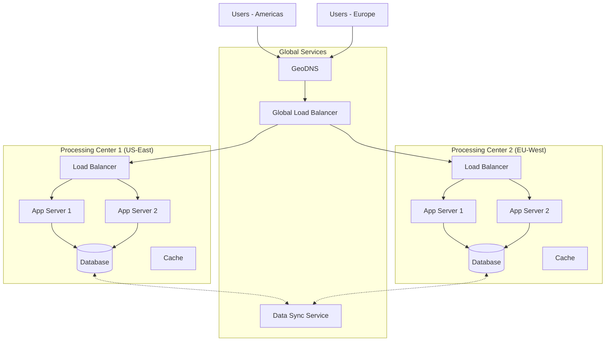
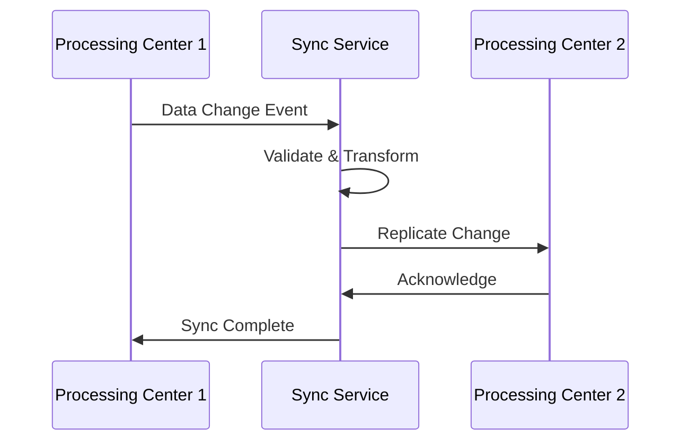

# Considerations for Multi-Processing Center Functionality

This section addresses the architectural considerations, design decisions, and implementation strategies for supporting multi-processing center functionality within the solution.

## Overview

Multi-processing center functionality enables the system to operate across multiple processing centers, data centers, or geographic locations. This capability is essential for:

- **Geographic Distribution:** Serving users in different regions with low latency
- **High Availability:** Ensuring system availability even if one center fails
- **Load Distribution:** Distributing processing load across multiple centers
- **Data Sovereignty:** Keeping data within specific geographic boundaries
- **Disaster Recovery:** Maintaining operations during regional outages

## Architecture for Multi-Processing Center

### Deployment Topology



### Key Architectural Patterns

1. **Active-Active Configuration**
   - All processing centers actively serve requests
   - Load distributed based on geography and capacity
   - Requires data synchronization between centers

2. **Active-Passive Configuration**
   - Primary center serves all requests
   - Secondary center on standby for failover
   - Simplified data consistency

3. **Active-Active with Sharding**
   - Data partitioned across centers
   - Each center owns specific data segments
   - Reduces synchronization complexity

## Data Management Strategies

### Data Residency and Sovereignty

| Data Type | Storage Strategy | Replication | Access Pattern |
|-----------|-----------------|-------------|----------------|
| **User Profiles** | Master in home center, replicated globally | Async replication | Read from nearest center, write to master |
| **Transactional Data** | Stored in processing center | Real-time replication | Read/write in processing center |
| **Reference Data** | Replicated to all centers | Sync on updates | Read from local center |
| **Audit Logs** | Stored locally, aggregated centrally | Batch replication | Write locally, aggregate for reporting |

### Data Consistency Models

**Eventual Consistency:**
- Suitable for non-critical data (user profiles, preferences)
- Changes propagate asynchronously
- Conflict resolution strategy required

**Strong Consistency:**
- Required for financial transactions, inventory
- Synchronous replication or distributed transactions
- May impact performance

**Causal Consistency:**
- Maintains order of related operations
- Balance between performance and consistency
- Suitable for collaborative features

### Data Synchronization



**Synchronization Strategies:**

1. **Event-Based Sync**
   - Changes published as events
   - Subscribers in other centers apply changes
   - Supports eventual consistency

2. **Database Replication**
   - Native database replication (master-slave, master-master)
   - Real-time or near-real-time sync
   - Automatic conflict resolution

3. **API-Based Sync**
   - Changes synchronized via REST/GraphQL APIs
   - Flexible but requires custom implementation
   - Good for heterogeneous systems

## Routing and Request Handling

### Global Load Balancing

**GeoDNS Routing:**
- Route users to nearest processing center
- Based on geographic location
- Failover to next nearest center

**Latency-Based Routing:**
- Route to center with lowest latency
- Requires health checks and latency monitoring
- Better user experience

**Weighted Round-Robin:**
- Distribute load based on center capacity
- Adjust weights dynamically
- Balance resource utilization

### Session Management

**Sticky Sessions:**
- Route user to same center for session duration
- Simplifies session management
- May cause imbalance

**Distributed Sessions:**
- Store session in shared cache (Redis)
- Accessible from any center
- Enables flexible routing

**Stateless Design:**
- Use JWT tokens, no server-side session
- Maximum flexibility
- Preferred approach

## Architectural Concerns for Multi-Processing Center

[See detailed concerns →](./architectural-concerns-testing.md)

## Failover and Disaster Recovery

### Failover Scenarios

**Processing Center Failure:**


**Database Failure:**
- Promote replica to primary
- Update application configuration
- Resume operations with new primary

**Network Partition:**
- Split-brain prevention
- Quorum-based decision making
- Manual intervention may be required

### Recovery Objectives

| Scenario | RTO (Recovery Time Objective) | RPO (Recovery Point Objective) |
|----------|------------------------------|-------------------------------|
| **Single Server Failure** | < 1 minute | 0 (no data loss) |
| **Processing Center Failure** | < 5 minutes | < 1 minute |
| **Regional Outage** | < 30 minutes | < 5 minutes |
| **Complete Disaster** | < 4 hours | < 1 hour |

## Performance Considerations

### Latency Optimization

- **Edge Caching:** Cache static content at edge locations
- **Data Locality:** Keep user data in nearest center
- **Connection Pooling:** Reuse connections across centers
- **Protocol Optimization:** Use efficient protocols (HTTP/2, gRPC)

### Cross-Center Communication

**Minimize Cross-Center Calls:**
- Cache frequently accessed data locally
- Batch requests when possible
- Use async communication for non-critical operations

**Optimize Network Paths:**
- Use dedicated network links between centers
- Implement quality of service (QoS)
- Monitor and optimize routing

## Monitoring and Observability

### Health Checks

```typescript
// Health check endpoint
app.get('/health', async (req, res) => {
  const health = {
    status: 'healthy',
    center: process.env.PROCESSING_CENTER_ID,
    timestamp: new Date().toISOString(),
    checks: {
      database: await checkDatabase(),
      cache: await checkCache(),
      dependencies: await checkDependencies()
    }
  };

  const overallStatus = Object.values(health.checks)
    .every(check => check.status === 'healthy');

  res.status(overallStatus ? 200 : 503).json(health);
});
```

### Metrics to Monitor

| Metric | Threshold | Action |
|--------|-----------|--------|
| **Request Latency** | p95 < 500ms | Investigate if exceeded |
| **Error Rate** | < 1% | Alert if exceeded |
| **Cross-Center Latency** | < 100ms | Optimize if exceeded |
| **Data Sync Lag** | < 60 seconds | Alert if exceeded |
| **Center Availability** | > 99.9% | Alert if below |

## Configuration Management

### Center-Specific Configuration

```yaml
# config/us-east-1.yaml
processingCenter:
  id: us-east-1
  region: us-east
  endpoints:
    api: https://api-us-east-1.example.com
    database: db-us-east-1.internal
  features:
    dataResidency: true
    crossCenterSync: true
  replication:
    targets:
      - eu-west-1
      - ap-south-1
    strategy: async
    conflictResolution: last-write-wins
```

### Feature Flags

Use feature flags to enable/disable multi-center features:

```typescript
const features = {
  'multi-center-routing': true,
  'cross-center-replication': true,
  'geo-based-routing': true,
  'center-failover': true
};
```

## Security Considerations

### Inter-Center Communication

- **Mutual TLS:** Secure communication between centers
- **API Authentication:** JWT tokens for inter-center requests
- **Network Isolation:** VPN or private network links
- **Encryption:** Encrypt data in transit between centers

### Data Protection

- **Encryption at Rest:** Encrypt data in all centers
- **Access Controls:** Restrict cross-center data access
- **Audit Logging:** Log all cross-center data access
- **Compliance:** Ensure compliance with regional regulations

---

:::warning Complexity
Multi-processing center functionality adds significant complexity. Ensure proper testing, monitoring, and operational procedures are in place.
:::

:::tip Best Practices
- Start with active-passive before implementing active-active
- Test failover procedures regularly
- Monitor data synchronization closely
- Have clear operational runbooks
:::
