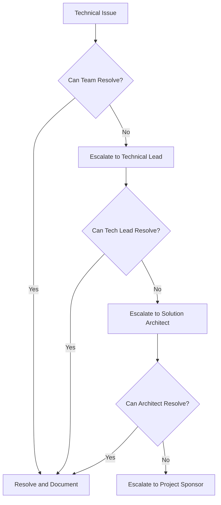

# Stakeholders

This section identifies all key stakeholders involved in the solution architecture, their roles, responsibilities, and interests in the project.

## Stakeholder Overview

Stakeholders are individuals, groups, or organizations that have an interest in or are affected by the solution architecture decisions and implementation.

## Primary Stakeholders

### Business Stakeholders

| Role | Name/Department | Responsibilities | Key Interests |
|------|----------------|------------------|---------------|
| **Project Sponsor** | [Name/Department] | Provides funding and executive support | ROI, strategic alignment, timely delivery |
| **Business Owner** | [Name/Department] | Defines business requirements and priorities | Business value, user satisfaction |
| **End Users** | [Department/Group] | Use the system for daily operations | Usability, performance, reliability |
| **Business Analysts** | [Team Name] | Translate business needs into requirements | Accurate requirements, stakeholder alignment |

### Technical Stakeholders

| Role | Name/Department | Responsibilities | Key Interests |
|------|----------------|------------------|---------------|
| **Solution Architect** | [Name] | Defines overall solution architecture | Technical feasibility, scalability, maintainability |
| **Technical Lead** | [Name] | Oversees technical implementation | Code quality, best practices, team productivity |
| **Development Team** | [Team Name] | Implements the solution | Clear requirements, technical specifications |
| **QA Team** | [Team Name] | Ensures quality and testing | Testability, quality standards, bug-free delivery |
| **DevOps Team** | [Team Name] | Manages deployment and operations | Deployability, monitoring, operational efficiency |

### Infrastructure and Operations

| Role | Name/Department | Responsibilities | Key Interests |
|------|----------------|------------------|---------------|
| **Infrastructure Team** | [Team Name] | Provides and manages infrastructure | Resource utilization, cost optimization |
| **Database Administrator** | [Name] | Manages database systems | Data integrity, performance, security |
| **Security Team** | [Team Name] | Ensures security compliance | Security standards, vulnerability management |
| **IT Operations** | [Department] | Maintains production systems | System stability, availability, incident management |

### Support and Maintenance

| Role | Name/Department | Responsibilities | Key Interests |
|------|----------------|------------------|---------------|
| **Support Team** | [Team Name] | Provides user support | User documentation, troubleshooting guides |
| **Training Team** | [Team Name] | Trains end users | Training materials, user adoption |

## External Stakeholders

### Vendors and Partners

| Organization | Role | Involvement | Key Interests |
|-------------|------|-------------|---------------|
| [Vendor Name] | Technology provider | Provides [specific service/product] | Contract fulfillment, product adoption |
| [Partner Name] | Integration partner | Provides integration services | Successful integration, ongoing relationship |

### Regulatory and Compliance

| Organization | Role | Involvement | Key Interests |
|-------------|------|-------------|---------------|
| [Regulatory Body] | Compliance authority | Ensures regulatory compliance | Adherence to regulations |
| [Audit Firm] | Auditor | Conducts compliance audits | Audit readiness, documentation |

## Stakeholder Engagement Strategy

### Communication Plan

| Stakeholder Group | Communication Frequency | Communication Method | Key Information |
|------------------|------------------------|---------------------|----------------|
| Executive Sponsors | Monthly | Executive summary, steering committee meetings | Progress, risks, budget |
| Business Owners | Bi-weekly | Status meetings, demos | Features, timeline, issues |
| Development Team | Daily | Stand-ups, sprint planning | Tasks, blockers, technical decisions |
| End Users | As needed | User testing sessions, training | Feature updates, release notes |

### Decision-Making Authority

| Decision Type | Primary Decision Maker | Consulted Stakeholders | Informed Stakeholders |
|--------------|----------------------|----------------------|----------------------|
| Strategic direction | Project Sponsor | Business Owner, Solution Architect | All stakeholders |
| Architecture decisions | Solution Architect | Technical Lead, Development Team | Business Owner, DevOps |
| Feature prioritization | Business Owner | End Users, Business Analysts | Development Team |
| Technical implementation | Technical Lead | Development Team, QA Team | Solution Architect |

## Stakeholder Requirements Matrix

### Business Stakeholder Requirements

- **Project Sponsor:**
  - Clear ROI and business case
  - Regular progress updates
  - Risk mitigation strategies
  - Budget adherence

- **Business Owner:**
  - Solution meets business objectives
  - User acceptance and adoption
  - Competitive advantage
  - Compliance with business processes

- **End Users:**
  - Intuitive and easy-to-use interface
  - Reliable and fast performance
  - Comprehensive training and support
  - Minimal disruption during deployment

### Technical Stakeholder Requirements

- **Solution Architect:**
  - Scalable and maintainable architecture
  - Technology alignment with enterprise standards
  - Clear technical documentation
  - Risk identification and mitigation

- **Development Team:**
  - Clear technical specifications
  - Modern development tools and practices
  - Adequate development time
  - Technical support and resources

- **DevOps Team:**
  - Automated deployment processes
  - Comprehensive monitoring and logging
  - Clear operational procedures
  - Disaster recovery capabilities

## Stakeholder Risks and Mitigation

| Stakeholder | Risk | Impact | Mitigation Strategy |
|------------|------|--------|---------------------|
| End Users | Resistance to change | Low adoption rates | Early involvement, comprehensive training, change management |
| Development Team | Unclear requirements | Delays, rework | Regular clarification sessions, prototypes, iterative feedback |
| Security Team | Non-compliance | Project delays, penalties | Early security reviews, compliance checkpoints |
| IT Operations | Operational complexity | Increased support burden | Comprehensive documentation, training, runbooks |

## Escalation Path

---

:::info Contact Information
For the most up-to-date contact information and stakeholder details, refer to the project management system or contact the project manager.
:::
